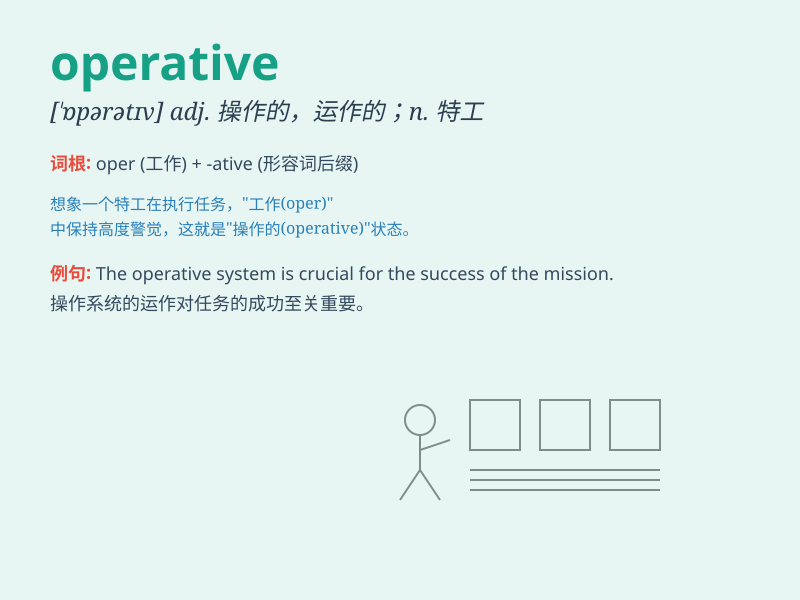

## operative

**英音:** _[\'ɒp(ə)rətɪv]_ **美音:** _[\'ɑpərətɪv]_

**译义:** *adj.运转着的,有效验的,手术的,实施的*

### 短语

+ **operative word:** _关键词；重要的词_

+ **operative mechanism:** _运行机制；操作机制_

+ **operative condition:** _运行条件；工作条件_

+ **become operative:** _生效；开始运作_

+ **operative staff:** _操作人员；业务人员_

### 例句

#### 例句1

> **The new machine is now operative.**

**中文翻译:** 新机器现在运转了。

**单词释义:** 运转着的；有效的

#### 例句2

> **The surgeon was the key operative in the successful
operation.**

**中文翻译:** 这位外科医生是这次成功手术中的关键手术人员。

**单词释义:** 手术人员；操作人员

#### 例句3

> **The plan will become operative next month.**

**中文翻译:** 这个计划下个月生效。

**单词释义:** 生效的；起作用的

### 背诵小故事

> A spy was sent on a mission. He needed to be operative and quick. He
sneaked into the enemy base, gathering crucial info. His operative
skills saved the day.

**一名间谍被派去执行任务。他需要高效且迅速。他潜入敌人基地，收集关键信息。他的行动能力挽救了局面。**

### 图义

