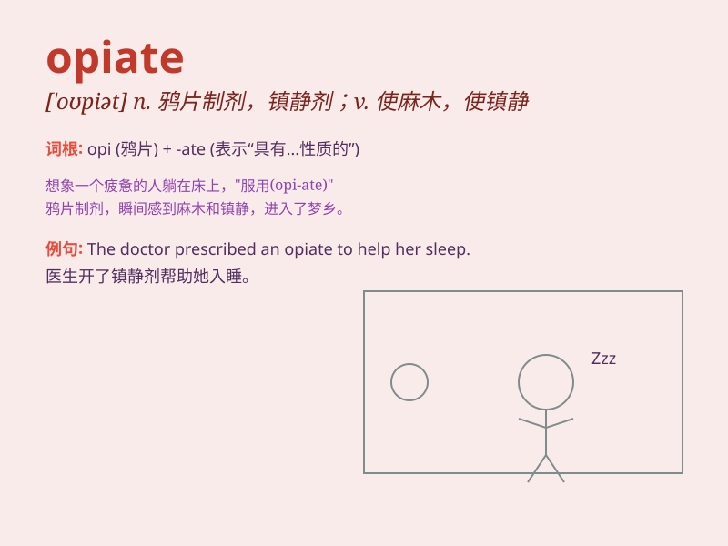

## opiate

**英音:** _[\'əʊpɪət]_ **美音:** _[\'opɪət]_

**译义:** *n.鸦片剂adj.安眠的v.缓和*

### 短语

+ **opiate drug:** _鸦片类药物_

+ **opiate addiction:** _鸦片类药物成瘾_

+ **opiate receptor:** _阿片受体_

+ **opiate analgesic:** _阿片类镇痛药_

+ **synthetic opiate:** _合成鸦片类药物_

### 例句

#### 例句1

> **The doctor prescribed an opiate to relieve her severe pain.**

**中文翻译:** 医生开了一种鸦片制剂来缓解她的剧痛。

**单词释义:** 鸦片制剂；麻醉剂

#### 例句2

> **Music can be an opiate for some people, helping them escape from
reality.**

**中文翻译:** 音乐对某些人来说可能是一种麻醉剂，帮助他们逃避现实。

**单词释义:** 起麻醉作用的事物

#### 例句3

> **His speech was like an opiate, lulling the audience into a false
sense of security.**

**中文翻译:** 他的演讲就像鸦片一样，使听众产生一种虚假的安全感。

**单词释义:** 使人麻痹的东西

### 背诵小故事

> A thief was caught stealing opiates. The police said these opiates
could make people sleep deeply and forget their troubles, but it was
illegal to have them. So remember, opiate is a powerful drug.

**一个小偷被抓到偷鸦片制剂。警察说这些鸦片制剂能让人沉睡并忘却烦恼，但拥有它们是违法的。所以记住，opiate
是强效的药物。**

### 图义

