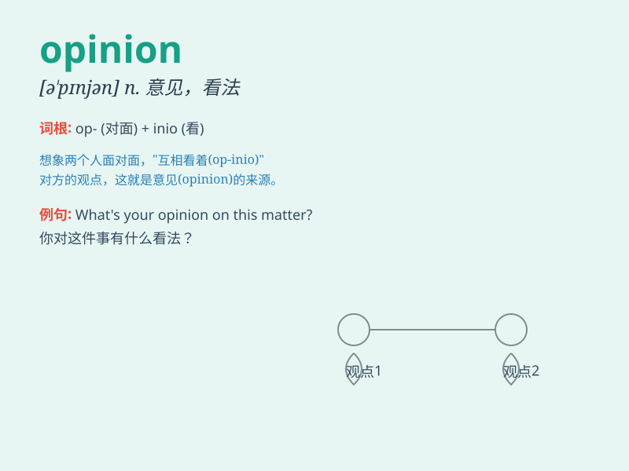

## opinion

**英音:** _[ə\'pɪnjən]_ **美音:** _[ə\'pɪnjən]_

**译义:** *n.意见,看法,主张,判断,评价*

### 短语

+ **in one\'s opinion:** _依某人看来_

+ **public opinion:** _公众舆论_

+ **personal opinion:** _个人意见_

+ **expert opinion:** _专家意见_

+ **have an opinion on:** _对\...\...有看法_

### 例句

#### 例句1

> **In my opinion, this book is very interesting.**

**中文翻译:** 在我看来，这本书非常有趣。

**单词释义:** 看法；意见

#### 例句2

> **Public opinion has turned against him.**

**中文翻译:** 公众舆论已经转而反对他。

**单词释义:** 舆论；民意

#### 例句3

> **I have a low opinion of that behavior.**

**中文翻译:** 我对那种行为评价很低。

**单词释义:** 评价；看法

### 背诵小故事

> One day, Tom and Jerry had a big argument. Tom expressed his opinion
that the cake was too sweet, but Jerry had a different opinion. They
kept discussing until they found a compromise.

**有一天，汤姆和杰瑞发生了激烈的争论。汤姆发表意见说蛋糕太甜了，但杰瑞有不同的看法。他们一直讨论，直到找到一个折中的办法。**

### 图义

