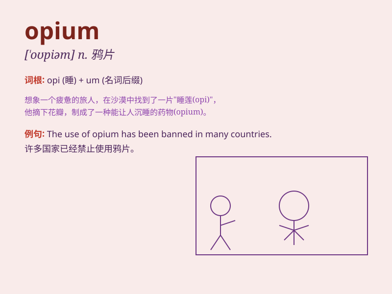

## opium

**英音:** _[\'əʊpɪəm]_ **美音:** _[\'opɪəm]_

**译义:** *n.鸦片vt.用鸦片处理*

### 短语

+ **opium poppy:** _罂粟_

+ **opium den:** _鸦片馆_

+ **opium trade:** _鸦片贸易_

+ **opium addiction:** _鸦片成瘾_

+ **opium war:** _鸦片战争_

### 例句

#### 例句1

> **The use and trade of opium are strictly prohibited in most
countries.**

**中文翻译:** 在大多数国家，鸦片的使用和交易被严格禁止。

**单词释义:** 鸦片

#### 例句2

> **He was addicted to opium and struggled to break the habit.**

**中文翻译:** 他对鸦片上瘾，努力戒除这个习惯。

**单词释义:** 鸦片

#### 例句3

> **The history of opium has had a significant impact on society.**

**中文翻译:** 鸦片的历史对社会产生了重大影响。

**单词释义:** 鸦片

### 背诵小故事

> Once upon a time, in a small village, a mysterious merchant brought a
strange substance called \'opium\'. It made people drowsy and addicted.
But soon, the villagers realized its harm and banned it.

**从前，在一个小村庄里，一个神秘的商人带来了一种叫做'鸦片'的奇怪物质。它让人昏昏欲睡并上瘾。但很快，村民们意识到了它的危害并禁止了它。**

### 图义

