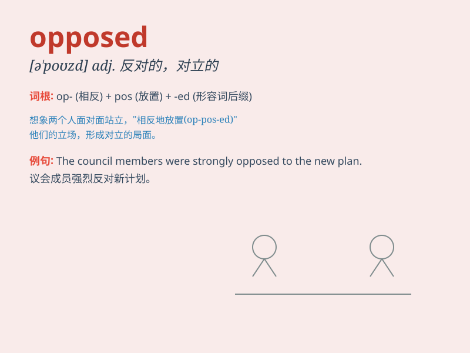

## opposed

**英音:** _[ə\'pəʊzd]_ **美音:** _[ə\'pozd]_

**译义:** *adj.反对的,敌对的*

### 短语

+ **be opposed to:** _反对；与......相对_

+ **as opposed to:** _与......相反；而不是_

+ **opposed view:** _相反的观点_

+ **opposed forces:** _敌对势力_

+ **opposed direction:** _相反的方向_

### 例句

#### 例句1

> **I am strongly opposed to this plan.**

**中文翻译:** 我强烈反对这个计划。

**单词释义:** 反对

#### 例句2

> **The two ideas are opposed to each other.**

**中文翻译:** 这两种想法相互对立。

**单词释义:** 对立的

#### 例句3

> **She was opposed to the new policy from the beginning.**

**中文翻译:** 她从一开始就反对新政策。

**单词释义:** 反对

### 背诵小故事

> A brave knight was on a quest. He encountered two paths, one leading
to treasure and the other to danger. The knight was opposed to taking
the dangerous path. He chose the path to treasure and succeeded. Opposed
means being against something.

**一位勇敢的骑士在探险。他遇到两条路，一条通向宝藏，另一条通向危险。骑士反对走危险的路。他选择了通向宝藏的路并成功了。Opposed
意思是反对。**

### 图义

