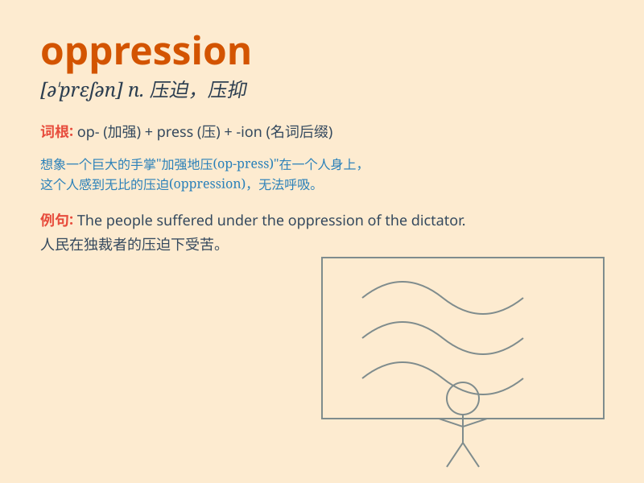

## oppression

**英音:** _[ə\'preʃ(ə)n]_ **美音:** _[ə\'prɛʃən]_

**译义:** *n.压迫,镇压,压抑,苦恼*

### 短语

+ **political oppression:** _政治压迫_

+ **economic oppression:** _经济压迫_

+ **gender oppression:** _性别压迫_

+ **social oppression:** _社会压迫_

+ **religious oppression:** _宗教压迫_

### 例句

#### 例句1

> **The people have long suffered under the oppression of the
dictatorship.**

**中文翻译:** 人民长期在独裁统治的压迫下受苦。

**单词释义:** 压迫；压制

#### 例句2

> **She fought against the oppression of women in her society.**

**中文翻译:** 她与她所在社会对妇女的压迫作斗争。

**单词释义:** 压迫；压制

#### 例句3

> **The novel describes the oppression and suffering of the working
class.**

**中文翻译:** 这部小说描述了工人阶级所遭受的压迫和苦难。

**单词释义:** 压迫；压制

### 背诵小故事

> In a distant kingdom, the poor villagers suffered from oppression.
The cruel king imposed heavy taxes and strict rules. But one brave soul
led a rebellion to fight against this oppression and bring freedom.

**在一个遥远的王国，贫困的村民遭受着压迫。残暴的国王征收重税和制定严格的规则。但一位勇敢的人领导了一场反抗，来对抗这种压迫并带来自由。**

### 图义

