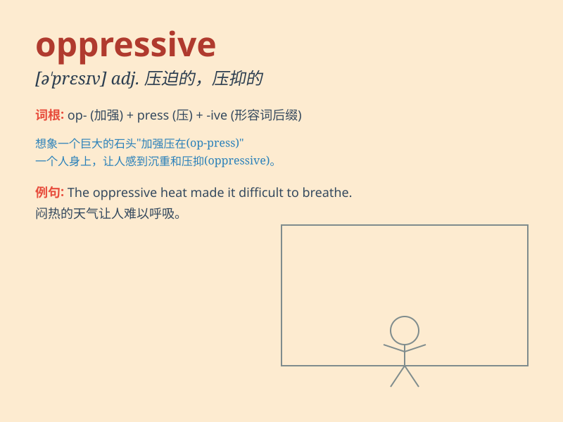

## oppressive

**英音:** _[ə\'presɪv]_ **美音:** _[ə\'prɛsɪv]_

**译义:** *adj.压制性的,压迫的,沉重的,难以忍受的*

### 短语

+ **oppressive heat:** _闷热_

+ **oppressive regime:** _压迫性的政权_

+ **oppressive atmosphere:** _压抑的气氛_

+ **oppressive rule:** _暴虐的统治_

+ **oppressive burden:** _沉重的负担_

### 例句

#### 例句1

> **The oppressive heat made it difficult to breathe.**

**中文翻译:** 令人窒息的高温让人呼吸困难。

**单词释义:** 令人难以忍受的；闷热的

#### 例句2

> **The oppressive regime denied people their basic rights.**

**中文翻译:** 这个专制政权剥夺了人们的基本权利。

**单词释义:** 专制的；压迫的

#### 例句3

> **She felt oppressed by the oppressive atmosphere at work.**

**中文翻译:** 她感到被工作中的压抑氛围所压迫。

**单词释义:** 压抑的；沉闷的

### 背诵小故事

> In a hot summer, I was in a small room with no fan. The air was thick
and heavy, making me feel oppressed. It was an oppressive environment
that made breathing difficult.

**在一个炎热的夏天，我在一个没有风扇的小房间里。空气又浓又重，让我感到压抑。这是一个令人压抑的环境，连呼吸都困难。**

### 图义

