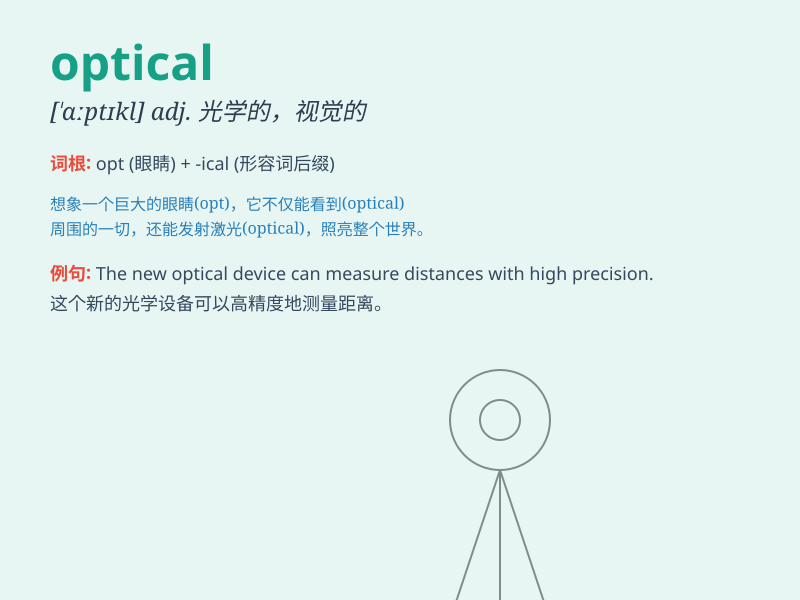

## optical

**英音:** _[\'ɒptɪk(ə)l]_ **美音:** _[\'ɑptɪkl]_

**译义:** *adj.眼的,视力的,光学的*

### 短语

+ **optical illusion:** _视错觉；光幻觉_

+ **optical fibre:** _光纤_

+ **optical microscope:** _光学显微镜_

+ **optical disc:** _光盘；光碟_

+ **optical character recognition:** _光学字符识别_

### 例句

#### 例句1

> **The optical microscope enables scientists to observe tiny
organisms.**

**中文翻译:** 光学显微镜使科学家能够观察微小的生物。

**单词释义:** 光学的

#### 例句2

> **She has an optical illusion that the road is narrower than it
actually is.**

**中文翻译:** 她有一种错觉，觉得这条路比实际窄。

**单词释义:** 视觉的；错觉的

#### 例句3

> **The new optical technology has greatly improved image
quality.**

**中文翻译:** 新的光学技术大大提高了图像质量。

**单词释义:** 光学的

### 背诵小故事

> One day, a little ant was lost in a dark cave. Suddenly, it saw an
optical fiber that emitted bright light, guiding it out. The light from
the optical fiber was like a magical helper.

**有一天，一只小蚂蚁在黑暗的洞穴中迷路了。突然，它看到一根发出明亮光芒的光纤，引导它走了出去。光纤发出的光就像神奇的帮手。**

### 图义

