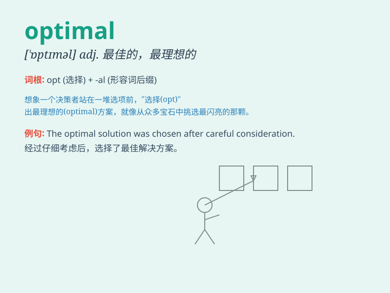

## optimal

**英音:** _[\'ɒptɪm(ə)l]_ **美音:** _[\'ɑptəml]_

**译义:** *adj.最佳的,最理想的*

### 短语

+ **optimal solution:** _最优解_

+ **optimal performance:** _最佳性能_

+ **optimal choice:** _最优选择_

+ **optimal condition:** _最佳条件_

+ **optimal design:** _优化设计_

### 例句

#### 例句1

> **We need to find the optimal solution to this problem.**

**中文翻译:** 我们需要找到这个问题的最佳解决方案。

**单词释义:** 最佳的

#### 例句2

> **The optimal time to visit that place is in spring.**

**中文翻译:** 去那个地方的最佳时间是春天。

**单词释义:** 最佳的

#### 例句3

> **This machine is working at its optimal performance.**

**中文翻译:** 这台机器正以其最佳性能运转。

**单词释义:** 最佳的

### 背诵小故事

> 想象一个运动员在参加比赛，他不断调整训练方法，最终找到了 optimal
的状态，赢得了金牌。这个状态就是最好的、最理想的，能让他发挥出全部实力。

**想象一位运动员在参赛时，不断调整训练方式，最终达到最优状态并赢得金牌。此状态即最好、最理想，能使他全力发挥。**

### 图义

