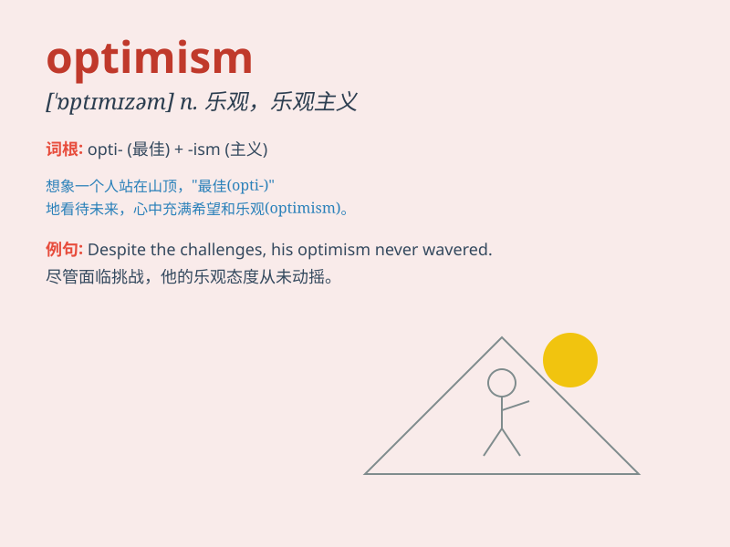

## optimism

**英音:** _[\'ɒptɪmɪz(ə)m]_ **美音:** _[\'ɑptɪmɪzəm]_

**译义:** *n.乐观,乐观主义*

### 短语

+ **unbounded optimism:** _无限的乐观_

+ **cautious optimism:** _谨慎的乐观_

+ **blind optimism:** _盲目的乐观_

+ **groundless optimism:** _毫无根据的乐观_

+ **infectious optimism:** _富有感染力的乐观_

### 例句

#### 例句1

> **Her optimism helped her overcome many difficulties.**

**中文翻译:** 她的乐观精神帮助她克服了许多困难。

**单词释义:** 乐观；乐观主义

#### 例句2

> **Despite the setbacks, he maintained an unwavering optimism.**

**中文翻译:** 尽管遭遇挫折，他仍然保持着坚定不移的乐观。

**单词释义:** 乐观；乐观主义

#### 例句3

> **The report was filled with optimism about the company\'s
future.**

**中文翻译:** 这份报告对公司的未来充满了乐观。

**单词释义:** 乐观；乐观的看法

### 背诵小故事

> Once upon a time, there was a man named Tom. Despite facing many
difficulties, he always saw the bright side. His positive attitude was
called optimism. It made him keep going and finally achieve success.

**从前，有个叫汤姆的人。尽管面临许多困难，他总是看到好的一面。他这种积极的态度被称为乐观。这使他不断前进，最终取得成功。**

### 图义

