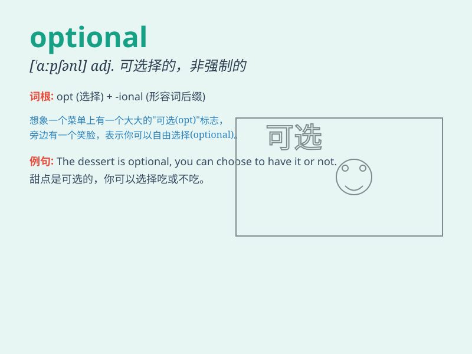

## optional

**英音:** _[\'ɒpʃ(ə)n(ə)l]_ **美音:** _[\'ɑpʃənl]_

**译义:** *adj.可选择的,随意的*

### 短语

+ **optional course:** _选修课_

+ **optional extra:** _可选的附加项_

+ **optional feature:** _可选特性_

+ **make optional:** _使成为可选择的_

+ **optional equipment:** _可选设备_

### 例句

#### 例句1

> **The course offers optional modules in the second year.**

**中文翻译:** 这门课程在第二年提供可选模块。

**单词释义:** 可选的

#### 例句2

> **Attendance at the meeting is optional.**

**中文翻译:** 参加会议是可选择的。

**单词释义:** 可选择的；非强制的

#### 例句3

> **The insurance policy is optional but highly recommended.**

**中文翻译:** 这份保险单是可选的，但强烈推荐。

**单词释义:** 可选择的

### 背诵小故事

> A student was choosing courses. There were many options. Some were
required, but some were optional. He happily picked the optional ones
that interested him the most.

**一个学生在选课。有很多选择。有些是必修的，但有些是选修的。他高兴地选了最让他感兴趣的选修课程。**

### 图义

