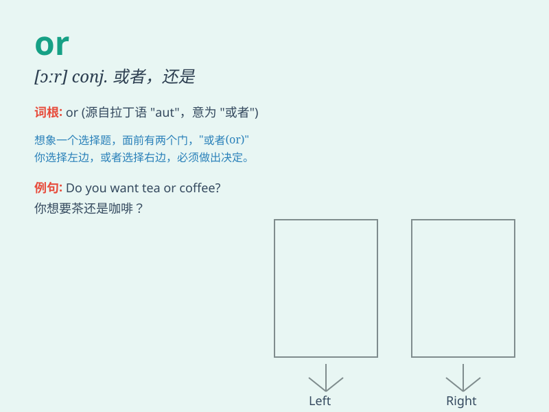

## or

**英音:** _[ɔː]_ **美音:** _[ɔr]_

**译义:** * conj.或,或者,还是 [军] Operational
Requirement,作战需求 [军] Operations Research,运筹学研究*

### 短语

+ **either\... or\...:**
_要么......要么......；不是......就是......_

+ **or else:** _否则；要不然_

+ **now or never:** _机不可失；勿失良机_

+ **more or less:** _或多或少；差不多；大约_

+ **whether\... or\...:**
_是......还是......；不管......还是......_

### 例句

#### 例句1

> **You can have tea or coffee.**

**中文翻译:** 你可以喝茶或者咖啡。

**单词释义:** 或者

#### 例句2

> **Is it a boy or a girl?**

**中文翻译:** 是男孩还是女孩？

**单词释义:** 还是

#### 例句3

> **Hurry up, or you\'ll be late.**

**中文翻译:** 快点，否则你会迟到的。

**单词释义:** 否则

### 背诵小故事

> One day, a little boy was choosing between an apple or an orange. He
thought hard and finally picked the orange. \'Or\' means a choice
between two things.

**有一天，一个小男孩要在苹果或者橙子之间做选择。他苦苦思索，最后选了橙子。'or'的意思是在两个事物之间做选择。**

### 图义

