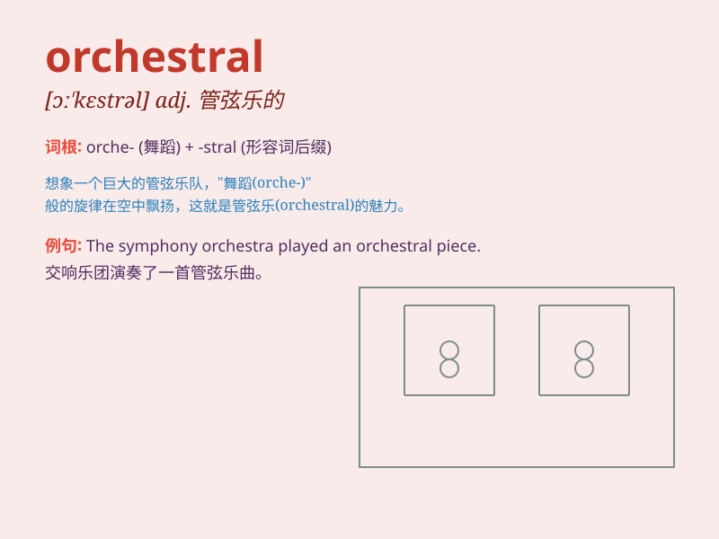

## orchestral

**英音:** _[ɔː\'kestr(ə)l]_ **美音:** _[ɔr\'kɛstrəl]_

**译义:** *adj.管弦乐的,管弦乐队的*

### 短语

+ **orchestral music:** _管弦乐_

+ **orchestral performance:** _管弦乐演奏_

+ **orchestral score:** _管弦乐总谱_

+ **orchestral arrangement:** _管弦乐编曲_

+ **orchestral conductor:** _管弦乐队指挥_

### 例句

#### 例句1

> **The orchestral performance was simply breathtaking.**

**中文翻译:** 这场管弦乐演出简直令人叹为观止。

**单词释义:** 管弦乐的

#### 例句2

> **She has a deep love for orchestral music.**

**中文翻译:** 她深深地热爱着管弦乐。

**单词释义:** 管弦乐的

#### 例句3

> **The orchestral arrangement of this piece is very complex.**

**中文翻译:** 这首曲子的管弦乐编曲非常复杂。

**单词释义:** 管弦乐的

### 背诵小故事

>
想象一个盛大的音乐会，舞台上有各种乐器。指挥家挥动指挥棒，协调着所有乐器的演奏，这就是\'orchestral\'的场景，意味着与管弦乐队相关的。

**想象一场盛大音乐会中指挥家协调管弦乐队演奏的场景来辅助记忆\'orchestral\'，意思是与管弦乐队相关的。**

### 图义

