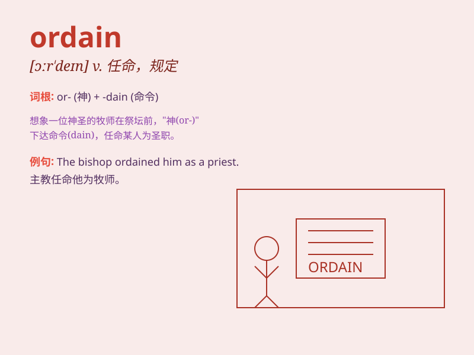

## ordain

**英音:** _[ɔː\'deɪn]_ **美音:** _[ɔr\'den]_

**译义:** *vt.注定,规定,任命(牧师)vi.颁布命令*

### 短语

+ **ordain as:** _任命为_

+ **ordain to:** _注定要_

+ **ordain for:** _为\...指定_

+ **be ordained:** _被任命_

+ **ordain priesthood:** _授予神职_

### 例句

#### 例句1

> **He was ordained as a priest last year.**

**中文翻译:** 他去年被任命为牧师。

**单词释义:** 任命；授予圣职

#### 例句2

> **Fate seemed to have ordained that they should meet.**

**中文翻译:** 命运似乎注定他们要相遇。

**单词释义:** 注定；规定

#### 例句3

> **The law ordains that all citizens must pay taxes.**

**中文翻译:** 法律规定所有公民必须纳税。

**单词释义:** 规定；命令

### 背诵小故事

> A young man had a strong calling to become a priest. One day, in a
sacred ceremony, a bishop ordain ed him, giving him the authority and
responsibility to serve. From then on, he dedicated his life to the
church.

**一个年轻人强烈渴望成为牧师。有一天，在一个神圣的仪式上，一位主教为他授圣职，赋予他权力和责任去服务。从此，他将一生奉献给了教会。**

### 图义

