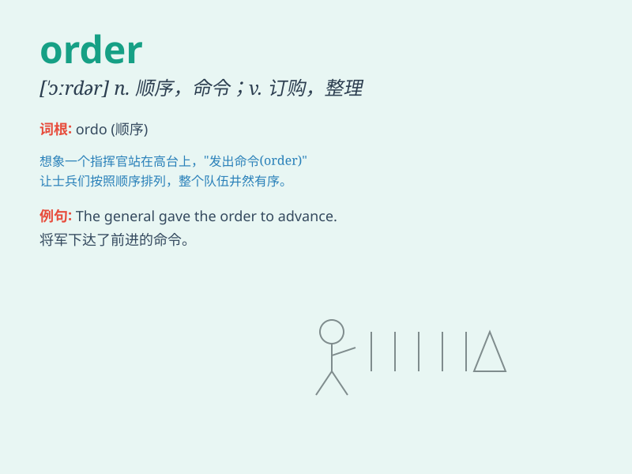

## order

**英音:** _[\'ɔːdə]_ **美音:** _[\'ɔrdɚ]_

**译义:**
*n.次序,顺序,正常(工作)状态,秩序,会议规则,命令,定购,定单vt.命令,定购,定制*

### 短语

+ **in order:** _整齐，秩序井然；按顺序；状况良好_

+ **out of order:** _发生故障；次序颠倒_

+ **place an order:** _订购；下单_

+ **order sb. to do sth.:** _命令某人做某事_

+ **keep order:** _维持秩序_

### 例句

#### 例句1

> **I placed an order for a new book online.**

**中文翻译:** 我在网上订购了一本新书。

**单词释义:** 订单；订购

#### 例句2

> **The teacher ordered the students to be quiet.**

**中文翻译:** 老师命令学生们安静。

**单词释义:** 命令；指示

#### 例句3

> **The books are arranged in alphabetical order.**

**中文翻译:** 这些书是按字母顺序排列的。

**单词释义:** 顺序；次序

### 背诵小故事

> One day, a king gave an order to his soldiers to protect the castle.
The soldiers quickly followed the order and stood guard. The word
\'order\' here means a command or instruction.

**一天，国王向他的士兵下达了一个命令来保护城堡。士兵们迅速遵循这个命令站岗守卫。单词\'order\'在这里指的是命令或指示。**

### 图义

