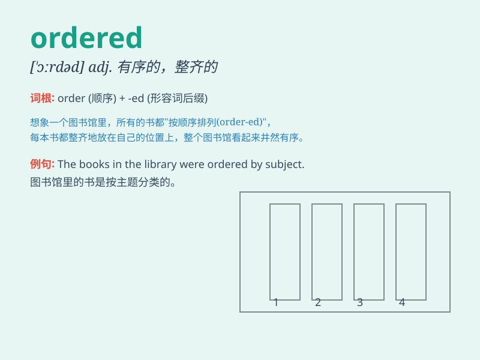

## ordered

**英音:** _[ˈɔːdəd]_ **美音:** _[ˈɔːrdərd]_

**译义:** *adj. 有条理的；整齐的；安排好的；v.
命令；订购；点（酒菜等）；（order 的过去式和过去分词）*

### 短语

+ **ordered pair:** _序偶；有序对偶_

+ **ordered list:** _有序列表_

+ **ordered set:** _有序集_

+ **well-ordered:** _良序的_

+ **partially ordered:** _偏序的_

### 例句

#### 例句1

> **The waitress ordered the food for the customers.**

**中文翻译:** 女服务员为顾客点了食物。

**单词释义:** 点（餐）

#### 例句2

> **He ordered his troops to advance.**

**中文翻译:** 他命令他的部队前进。

**单词释义:** 命令

#### 例句3

> **The company ordered a large quantity of raw materials.**

**中文翻译:** 公司订购了大量的原材料。

**单词释义:** 订购

### 背诵小故事

> A king ordered his soldiers to protect the castle. The soldiers
quickly followed the order and stood in position. \'Ordered\' means to
give an instruction or command.

**一位国王命令他的士兵保卫城堡。士兵们迅速遵循命令并就位。\'ordered\'意思是给出指示或命令。**

### 图义

