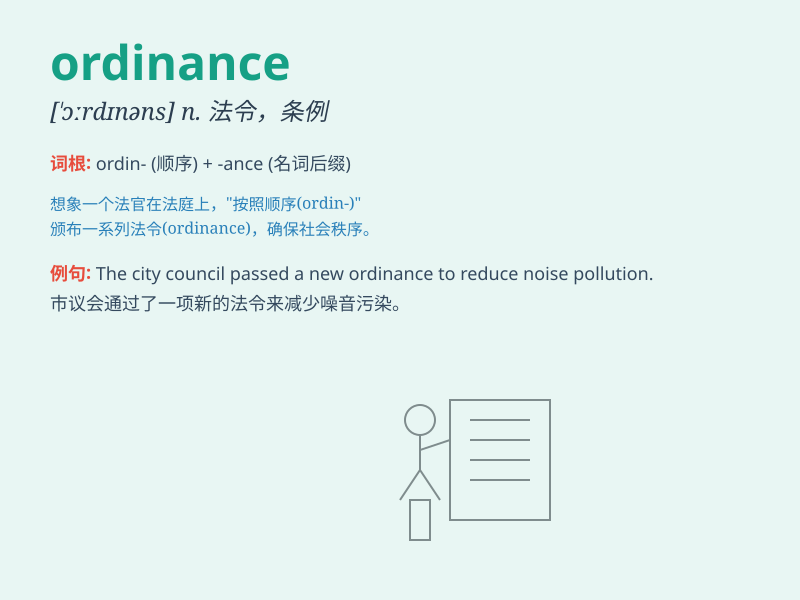

## ordinance

**英音:** _[\'ɔːdɪnəns]_ **美音:** _[\'ɔrdnəns]_

**译义:** *n.法令,训令,布告,条例,圣餐礼,传统的风俗习惯*

### 短语

+ **municipal ordinance:** _市政条例_

+ **fire ordinance:** _消防条例_

+ **zoning ordinance:** _分区条例_

+ **building ordinance:** _建筑条例_

+ **environmental ordinance:** _环境条例_

### 例句

#### 例句1

> **The city passed a new ordinance to regulate parking.**

**中文翻译:** 这座城市通过了一项新的法令来规范停车。

**单词释义:** 法令

#### 例句2

> **The violation of the ordinance could result in a fine.**

**中文翻译:** 违反该条例可能会导致罚款。

**单词释义:** 条例

#### 例句3

> **The local ordinance prohibits the sale of alcohol after
midnight.**

**中文翻译:** 当地的法令禁止在午夜后销售酒精。

**单词释义:** 法令

### 背诵小故事

> A king issued an ordinance that everyone must follow. It was like a
strict rule that no one could break. The word \'ordinance\' means an
order or law made by a government or authority.

**一位国王颁布了一项法令，每个人都必须遵守。它就像一条严格的规定，无人能够打破。单词\'ordinance\'意思是政府或权威机构制定的命令或法律。**

### 图义

