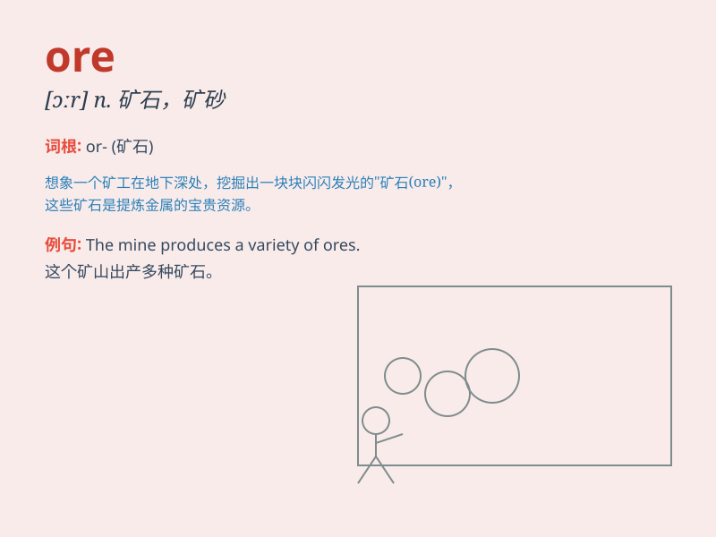

## ore

**英音:** _[ɔː]_ **美音:** _[ɔr]_

**译义:** *n.矿石,含有金属的岩石*

### 短语

+ **iron ore:** _铁矿石_

+ **copper ore:** _铜矿石_

+ **ore deposit:** _矿床_

+ **ore dressing:** _选矿；矿石处理_

+ **rich ore:** _富矿_

### 例句

#### 例句1

> **Iron ore is an important raw material for steel production.**

**中文翻译:** 铁矿石是钢铁生产的重要原材料。

**单词释义:** 矿石

#### 例句2

> **The miners were digging for ore in the deep mine.**

**中文翻译:** 矿工们在深矿井里挖掘矿石。

**单词释义:** 矿石

#### 例句3

> **This area is rich in copper ore.**

**中文翻译:** 这个地区富含铜矿石。

**单词释义:** 矿石

### 背诵小故事

> A brave miner was digging deep in the cave. After days of hard work,
he finally found some shiny ore. He knew it would bring great wealth and
joy to his village.

**一位勇敢的矿工在洞穴深处挖掘。经过数天的辛勤工作，他终于找到了一些闪闪发光的矿石。他知道这会给他的村庄带来巨大的财富和欢乐。**

### 图义

