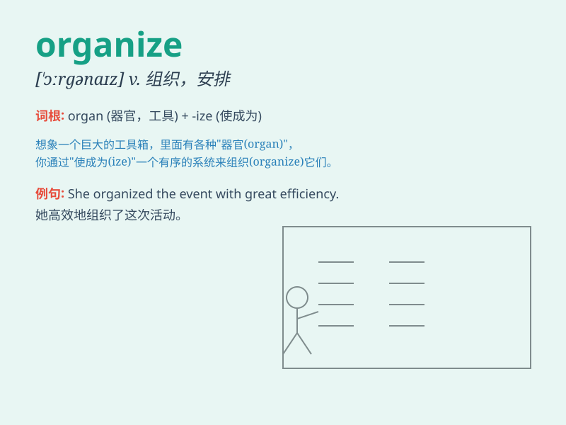

## organize

**英音:** _[ˈɔ:gənaɪz]_ **美音:** _[ɔrɡənˌaɪz]_

**译义:** *vt.组织,使有机化,给予生机vi.组织起来*

### 短语

+ **organize a party:** _组织一个聚会_

+ **organize an event:** _组织一个活动_

+ **organize a trip:** _组织一次旅行_

+ **organize a meeting:** _组织一场会议_

+ **organize one\'s thoughts:** _整理某人的思路_

### 例句

#### 例句1

> **We need to organize a party for her birthday.**

**中文翻译:** 我们需要为她的生日组织一个派对。

**单词释义:** 组织

#### 例句2

> **The company is well organized and efficient.**

**中文翻译:** 这家公司组织良好且高效。

**单词释义:** 组织（使有条理）

#### 例句3

> **She organized her thoughts before speaking.**

**中文翻译:** 她在发言前整理了自己的思路。

**单词释义:** 整理

### 背诵小故事

> One day, Tom was in a mess. His room was chaotic. So, he decided to
organize it. He sorted the books, folded the clothes, and cleaned the
desk. Finally, the room became tidy and nice.

**有一天，汤姆陷入了混乱。他的房间乱糟糟的。所以，他决定整理它。他整理了书籍，叠好了衣服，清理了书桌。最后，房间变得整洁又漂亮。**

### 图义

