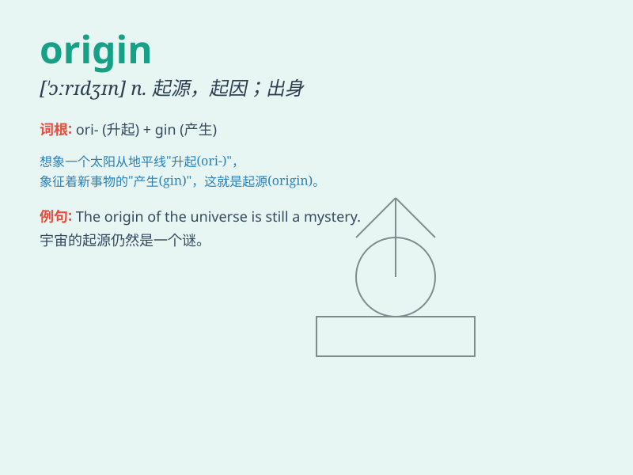

## origin

**英音:** _[\'ɒrɪdʒɪn]_ **美音:** _[\'ɔrɪdʒɪn]_

**译义:** *n.起源,由来,起因,出身,血统,[数]原点*

### 短语

+ **origin of species:** _物种起源_

+ **point of origin:** _原点；起始点_

+ **country of origin:** _原产国；原产地_

+ **place of origin:** _起源地；发祥地_

+ **original sin:** _原罪_

### 例句

#### 例句1

> **The origin of the universe is still a mystery.**

**中文翻译:** 宇宙的起源仍然是个谜。

**单词释义:** 起源；源头

#### 例句2

> **She is proud of her humble origin.**

**中文翻译:** 她为自己出身卑微而感到自豪。

**单词释义:** 出身；来历

#### 例句3

> **We need to trace the origin of this problem.**

**中文翻译:** 我们需要追查这个问题的根源。

**单词释义:** 根源；起因

### 背诵小故事

>
想象一下，在远古时代，有一个神秘的源头，它不断地涌出神奇的力量。这个源头就是'origin'，是一切的起始点。就像生命的起源，万物皆从这里开始。

**想象远古时代有个神秘的源头不断涌出神奇力量，这个源头就是'origin'，即一切的起始点，像生命起源，万物从这开始。**

### 图义

