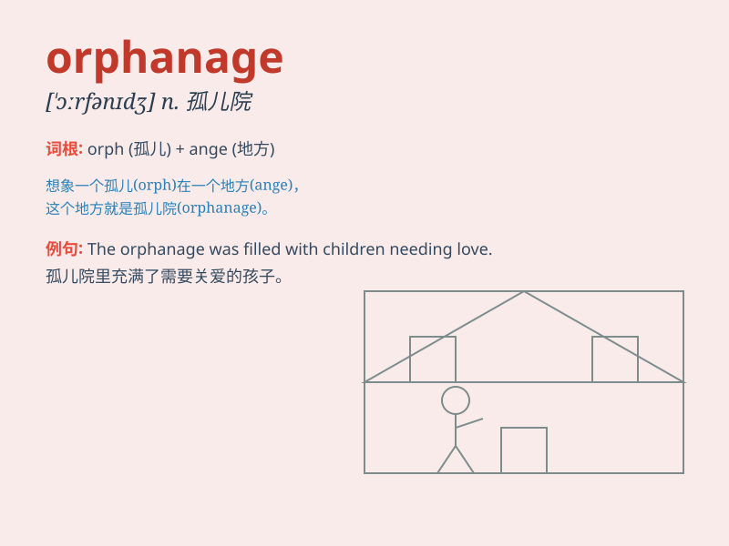

## orphanage

**英音:** _[\'ɔːf(ə)nɪdʒ]_ **美音:** _[\'ɔrfənɪdʒ]_

**译义:** *n.孤儿院,孤儿身份*

### 短语

+ **orphanage home:** _孤儿院_

+ **visit an orphanage:** _参观孤儿院_

+ **work in an orphanage:** _在孤儿院工作_

+ **orphanage children:** _孤儿院的孩子_

+ **build an orphanage:** _建造一所孤儿院_

### 例句

#### 例句1

> **The orphanage provides a loving home for children without
parents.**

**中文翻译:** 这家孤儿院为没有父母的孩子提供了一个充满爱的家。

**单词释义:** 孤儿院

#### 例句2

> **She spent her childhood in an orphanage.**

**中文翻译:** 她童年是在一家孤儿院度过的。

**单词释义:** 孤儿院

#### 例句3

> **We visited the orphanage to bring some gifts to the children.**

**中文翻译:** 我们参观了孤儿院，给孩子们带去了一些礼物。

**单词释义:** 孤儿院

### 背诵小故事

> A little girl was sent to an orphanage. She felt lonely at first but
later found friendship and warmth there. The orphanage became a special
place for her to grow. Remember, orphanage is a home for orphans.

**一个小女孩被送到了一家孤儿院。起初她感到孤独，但后来在那里找到了友谊和温暖。孤儿院成了她成长的特殊之地。记住，orphanage
就是孤儿院的意思。**

### 图义

