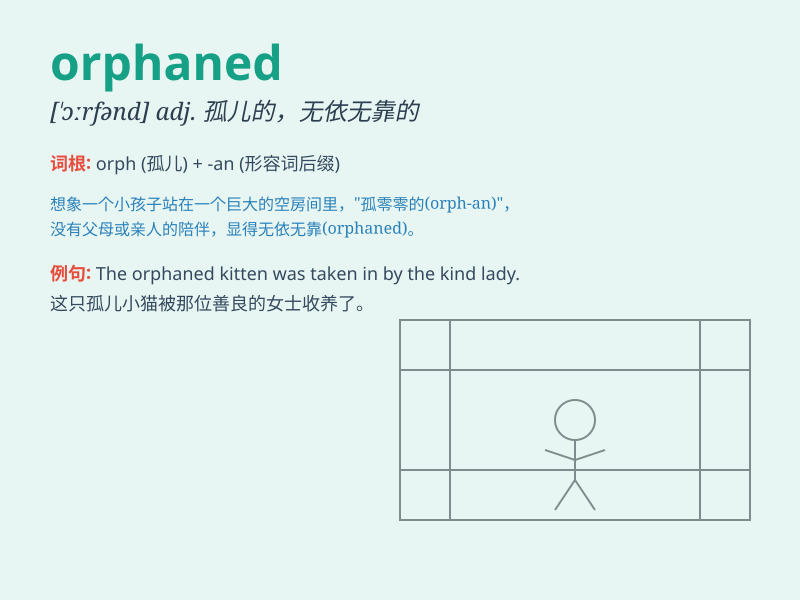

## orphaned

**英音:** _[ˈɔːfənd]_ **美音:** _[ˈɔːrfənd]_

**译义:** *adj. 失去父母的；孤儿的 v. 使成为孤儿（orphan
的过去式和过去分词）*

### 短语

+ **orphaned children:** _孤儿_

+ **orphaned pet:** _被遗弃的宠物_

+ **orphaned work:** _无人接手的工作_

+ **orphaned project:** _被搁置的项目_

+ **orphaned file:** _孤立文件_

### 例句

#### 例句1

> **The orphaned child was taken in by a kind family.**

**中文翻译:** 这个失去父母的孩子被一个善良的家庭收留了。

**单词释义:** 失去父母的

#### 例句2

> **The earthquake orphaned many children.**

**中文翻译:** 地震使许多孩子成为孤儿。

**单词释义:** 使成为孤儿

#### 例句3

> **She felt orphaned when her best friend moved away.**

**中文翻译:** 当她最好的朋友搬走时，她感觉自己被孤立了。

**单词释义:** 被孤立的；感到孤独无依的

### 背诵小故事

> A little girl was orphaned when her parents died in a car accident.
She felt lonely and scared, but with the help of kind people, she
gradually found love and hope. Remember, \'orphaned\' means having no
parents.

**一个小女孩在父母因车祸去世后成了孤儿。她感到孤独和害怕，但在善良人的帮助下，她逐渐找到了爱和希望。记住，\'orphaned\'意思是失去父母的。**

### 图义

