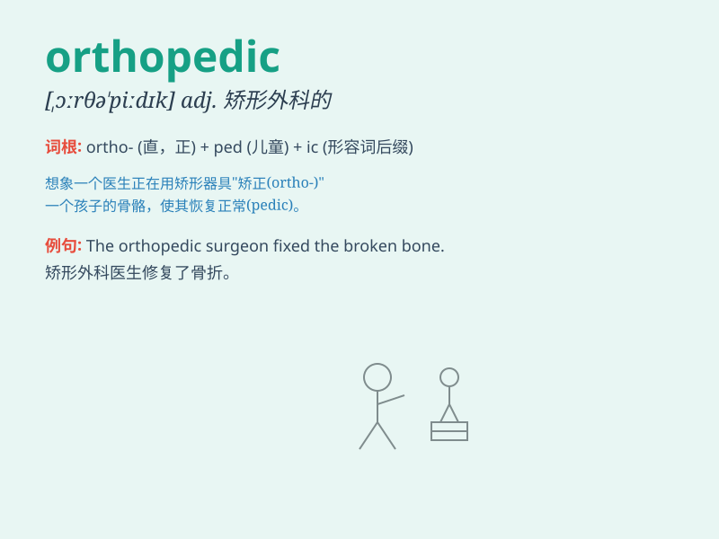

## orthopedic

**英音:** _[,ɔ:θə\'pi:dɪk]_ **美音:** _[ɔrθə\'pidɪk]_

**译义:** * (=orthopaedic)adj.[医]整形外科的*

### 短语

+ **orthopedic surgeon:** _矫形外科医生_

+ **orthopedic treatment:** _矫形治疗_

+ **orthopedic device:** _矫形器具_

+ **orthopedic hospital:** _骨科医院_

+ **orthopedic specialty:** _骨科专业_

### 例句

#### 例句1

> **The orthopedic surgeon recommended physical therapy for my
injured knee.**

**中文翻译:** 整形外科医生建议对我受伤的膝盖进行物理治疗。

**单词释义:** 骨科的

#### 例句2

> **She was referred to an orthopedic specialist for her chronic back
pain.**

**中文翻译:** 她因慢性背痛被转诊至骨科专家处。

**单词释义:** 骨科的

#### 例句3

> **The hospital has a well-equipped orthopedic department.**

**中文翻译:** 医院拥有设备齐全的骨科。

**单词释义:** 骨科的

### 背诵小故事

> A doctor specializing in orthopedic was treating a patient with a
broken bone. The doctor fixed it precisely, showing the expertise in
orthopedic care. Remember, orthopedic means related to the correction of
bones and joints.

**一位专攻骨科的医生正在治疗一位骨折的病人。医生精准地修复了它，展现了骨科治疗方面的专长。记住，orthopedic
意思是与骨骼和关节的矫正有关。**

### 图义

