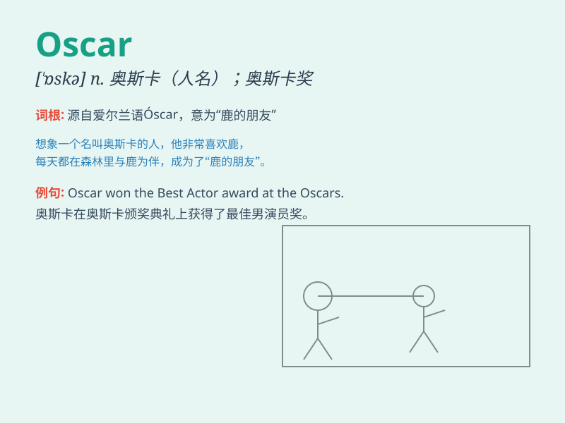

## Oscar

**英音:** _[ˈɒskə(r)]_ **美音:** _[ˈɑːskər]_

**译义:**
*n.奥斯卡奖，奥斯卡金像奖；奥斯卡雕像；用作名字（男子名）*

### 短语

+ **Oscar winner:** _奥斯卡获奖者_

+ **Oscar nomination:** _奥斯卡提名_

+ **Oscar ceremony:** _奥斯卡颁奖典礼_

+ **Oscar night:** _奥斯卡之夜_

+ **Oscar buzz:** _奥斯卡热潮_

### 例句

#### 例句1

> **Oscar won the best actor award this year.**

**中文翻译:** 奥斯卡今年获得了最佳男演员奖。

**单词释义:** 奥斯卡（人名）

#### 例句2

> **I\'m a big fan of Oscar\'s movies.**

**中文翻译:** 我是奥斯卡电影的超级粉丝。

**单词释义:** 奥斯卡（人名）

#### 例句3

> **Oscar has a unique acting style.**

**中文翻译:** 奥斯卡有独特的表演风格。

**单词释义:** 奥斯卡（人名）

### 背诵小故事

> Oscar
是一只可爱的小狗，它总是在奥斯卡颁奖典礼那天特别兴奋。因为它的主人会带着它一起看电视，它汪汪叫着，仿佛也在为获奖者欢呼。

**Oscar
是一只可爱的小狗，在奥斯卡颁奖典礼这天很兴奋，和主人一起看电视并欢呼。**

### 图义

