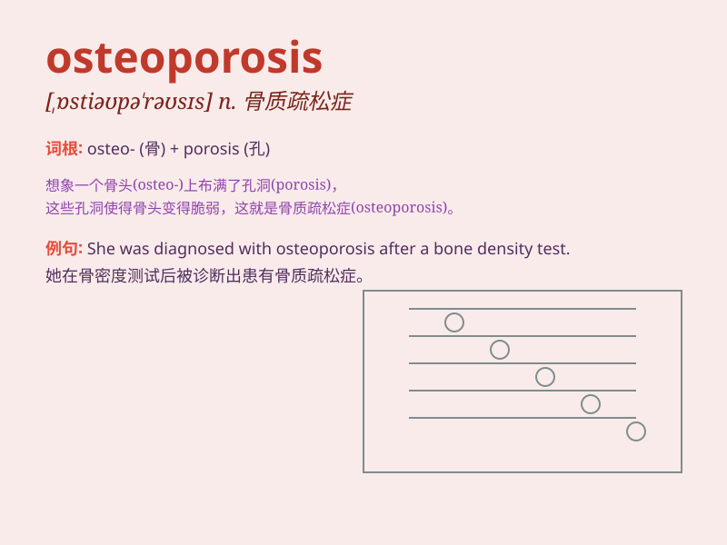

## osteoporosis

**英音:** _[,ɒstɪəʊpə\'rəʊsɪs]_ **美音:**
_[,ɑstɪopə\'rosɪs]_

**译义:** *n.骨质疏松症*

### 短语

+ **osteoporosis prevention:** _骨质疏松症预防_

+ **osteoporosis treatment:** _骨质疏松症治疗_

+ **postmenopausal osteoporosis:** _绝经后骨质疏松症_

+ **senile osteoporosis:** _老年性骨质疏松症_

+ **idiopathic osteoporosis:** _特发性骨质疏松症_

### 例句

#### 例句1

> **Osteoporosis is a common disease among the elderly.**

**中文翻译:** 骨质疏松症是老年人中的一种常见疾病。

**单词释义:** 骨质疏松症

#### 例句2

> **Regular exercise can help prevent osteoporosis.**

**中文翻译:** 经常锻炼有助于预防骨质疏松症。

**单词释义:** 骨质疏松症

#### 例句3

> **Her mother was diagnosed with osteoporosis last year.**

**中文翻译:** 她母亲去年被诊断出患有骨质疏松症。

**单词释义:** 骨质疏松症

### 背诵小故事

> Once upon a time, there was an old man. His bones were weak and
fragile. Doctors said he had osteoporosis. It\'s like the inside of his
bones became porous. Poor man! We should take care of our bones to avoid
this.

**从前，有一位老人。他的骨头又弱又脆。医生说他患有骨质疏松症。就好像他骨头内部变得多孔了。可怜的人！我们应该照顾好自己的骨头来避免这种情况。**

### 图义

