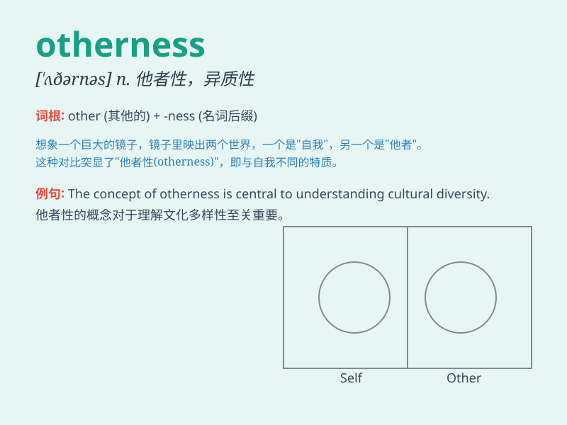

## otherness

**英音:** _[ˈʌðənəs]_ **美音:** _[ˈʌðərnəs]_

**译义:** *n.相异,不同,另一物*

### 短语

+ **sense of otherness:** _差异感；异类感_

+ **experience otherness:** _体验不同；感受差异_

+ **cultural otherness:** _文化差异；文化的不同之处_

+ **perceive otherness:** _察觉差异；感知不同_

+ **highlight otherness:** _突出差异；强调不同_

### 例句

#### 例句1

> **The concept of otherness is often explored in sociology.**

**中文翻译:** 社会学经常探讨差异性的概念。

**单词释义:** 他者性；相异性

#### 例句2

> **She was drawn to the otherness of the foreign culture.**

**中文翻译:** 她被异国文化所吸引。

**单词释义:** 独特性；差异性

#### 例句3

> **The otherness of his behavior made him stand out in the
crowd.**

**中文翻译:** 他的与众不同的行为使他在人群中脱颖而出。

**单词释义:** 与众不同；异样

### 背诵小故事

> Once upon a time, in a faraway land, there was a unique village.
Everyone was the same except for one person. This person\'s uniqueness
was called \'otherness\'. It made them stand out and be different from
the rest.

**从前，在一个遥远的地方，有一个独特的村庄。每个人都一样，除了一个人。这个人的独特之处被称为"差异性"。这使他们脱颖而出，与其他人不同。**

### 图义

