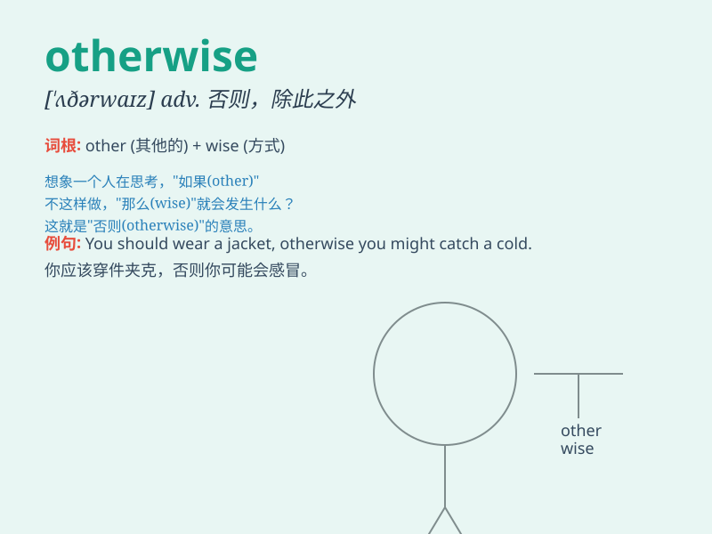

## otherwise

**英音:** _[\'ʌðəwaɪz]_ **美音:** _[\'ʌðɚwaɪz]_

**译义:** *adv.另外,否则,不同地,别的方式adj.另外的,其他方面的*

### 短语

+ **or otherwise:** _或相反；或其他情况_

+ **otherwise than:** _不像；除...外；与...不同_

+ **be otherwise engaged:** _忙于别的事_

+ **otherwise known as:** _又名；亦称_

+ **otherwise disposed of:** _以其他方式处置_

### 例句

#### 例句1

> **You should study harder; otherwise, you will fail the exam.**

**中文翻译:** 你应该更加努力地学习；否则，你将考试不及格。

**单词释义:** 否则；要不然

#### 例句2

> **The rent is high, but otherwise the house is satisfactory.**

**中文翻译:** 房租虽高，但房子其他方面还算满意。

**单词释义:** 在其他方面

#### 例句3

> **He is slow but otherwise an excellent worker.**

**中文翻译:** 他虽然很慢，但在其他方面是一位出色的工人。

**单词释义:** 在其他方面

### 背诵小故事

> One day, I planned to go hiking. But the weather was bad. Otherwise,
I would have enjoyed the beautiful scenery. It means in a different way
or under different circumstances.

**有一天，我计划去远足。但天气很差。否则，我本可以欣赏到美丽的风景。这个单词意思是在不同的方式下或者在不同的情形下。**

### 图义

