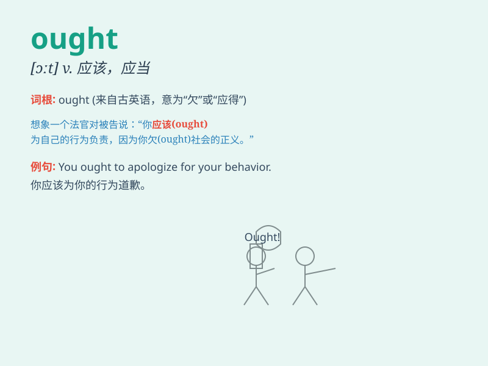

## ought

**英音:** _[ɔːt]_ **美音:** _[ɔt]_

**译义:** * aux.(～ to [verb]) 应当,应该*

### 短语

+ **ought to:** _应该；应当_

+ **ought not:** _不应该；不应_

+ **ought to do:** _应该做_

+ **ought to have done:** _本应该做（而实际上未做）_

+ **ought to be:** _应该是_

### 例句

#### 例句1

> **You ought to study harder if you want to pass the exam.**

**中文翻译:** 如果你想通过考试，你就应该更加努力地学习。

**单词释义:** 应该

#### 例句2

> **He ought to be more careful when driving.**

**中文翻译:** 他开车时应该更加小心。

**单词释义:** 应该

#### 例句3

> **We ought not to waste food.**

**中文翻译:** 我们不应该浪费食物。

**单词释义:** 不应该

### 背诵小故事

> One day, a little boy was lost in a forest. He ought to stay calm and
find a way out. With this thought in mind, he finally found the path
home. Remember, \'ought\' means should or be obliged to.

**有一天，一个小男孩在森林里迷路了。他应该保持冷静并找到出路。带着这个想法，他最终找到了回家的路。记住，\'ought\'意思是应该或有义务。**

### 图义

