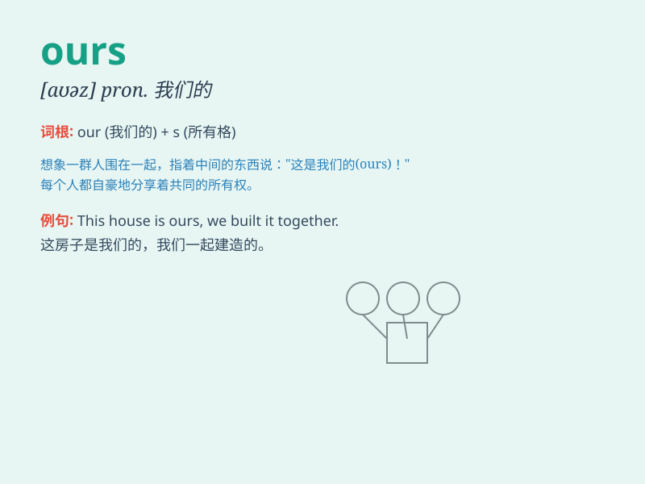

## ours

**英音:** _[aʊəz]_ **美音:** _[ɑrz]_

**译义:** * pron.我们的*

### 短语

+ **ours alone:** _只属于我们的_

+ **ours sincerely:** _我们真诚地_

+ **ours forever:** _永远属于我们_

+ **yours and ours:** _你我双方的_

+ **all ours:** _全是我们的_

### 例句

#### 例句1

> **This house is ours.**

**中文翻译:** 这房子是我们的。

**单词释义:** 我们的（东西）

#### 例句2

> **The victory is ours.**

**中文翻译:** 胜利是我们的。

**单词释义:** 我们的（成果）

#### 例句3

> **Ours is a big family.**

**中文翻译:** 我们是一个大家庭。

**单词释义:** 我们的（家庭）

### 背诵小故事

> We have a big garden, but it\'s not just mine. It\'s ours. We all
take care of it and enjoy the beautiful flowers together. Remember, ours
means something belongs to us all.

**我们有一个大花园，但它不只是我的。它是我们的。我们都照顾它，并一起欣赏美丽的花朵。记住，ours
意思是属于我们所有人的。**

### 图义

