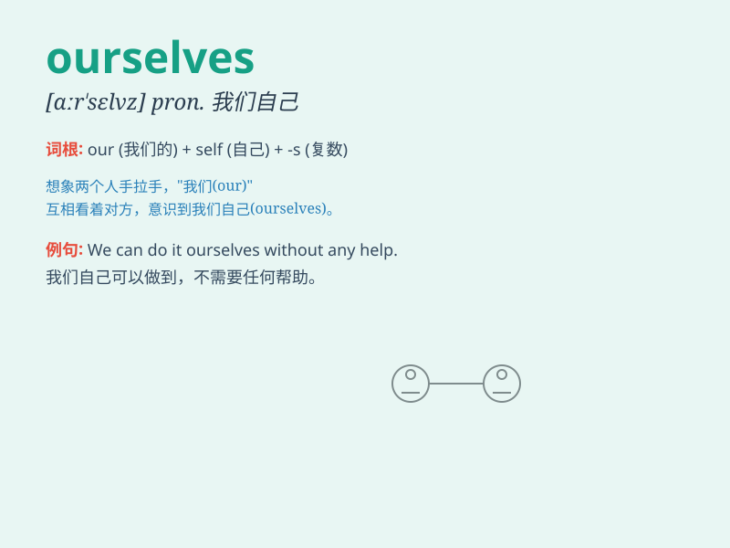

## ourselves

**英音:** _[aʊə\'selvz]_ **美音:** _[ɑr\'sɛlvz]_

**译义:** * pron.我们自己*

### 短语

+ **by ourselves:** _独自；单独_

+ **for ourselves:** _为我们自己_

+ **among ourselves:** _在我们之间_

+ **to ourselves:** _对我们自己_

+ **of ourselves:** _我们自己的_

### 例句

#### 例句1

> **We did the work ourselves.**

**中文翻译:** 我们自己做这项工作。

**单词释义:** 我们自己

#### 例句2

> **We must believe in ourselves.**

**中文翻译:** 我们必须相信自己。

**单词释义:** 我们自己

#### 例句3

> **Let\'s enjoy ourselves at the party.**

**中文翻译:** 让我们在聚会上尽情享受吧。

**单词释义:** 我们自己

### 背诵小故事

> One day, we were lost in a forest. We had to rely on ourselves to
find the way out. We kept encouraging each other, saying \'We can do it
ourselves!\' Finally, we succeeded.

**有一天，我们在森林里迷路了。我们不得不依靠我们自己找到出路。我们不断互相鼓励，说'我们自己能做到！'最后，我们成功了。**

### 图义

