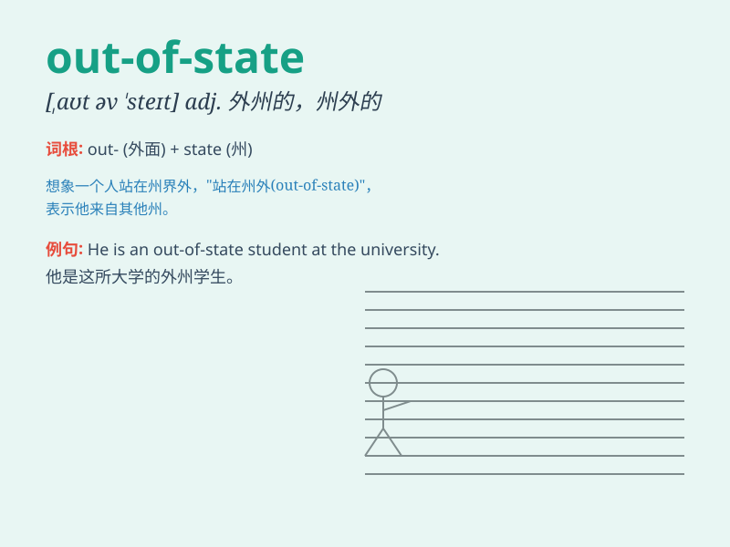

## out-of-state

**英音:** _[ˌaʊt əv ˈsteɪt]_ **美音:** _[ˌaʊt əv
ˈsteɪt]_

**译义:** *adj. 外州的；来自外州的；非本州的*

### 短语

+ **out-of-state student:** _州外学生_

+ **out-of-state license:** _州外执照_

+ **out-of-state trip:** _州外旅行_

+ **out-of-state company:** _州外公司_

+ **out-of-state driver:** _州外司机_

### 例句

#### 例句1

> **I\'m considering attending an out-of-state university for better
educational opportunities.**

**中文翻译:** 我正在考虑去外州的大学以获得更好的教育机会。

**单词释义:** 州外的

#### 例句2

> **The company is expanding and opening new branches in out-of-state
locations.**

**中文翻译:** 这家公司正在扩张，并在州外的地方开设新的分支机构。

**单词释义:** 州外的

#### 例句3

> **Out-of-state visitors often come to enjoy our local
festivals.**

**中文翻译:** 州外的游客经常来享受我们当地的节日。

**单词释义:** 州外的

### 背诵小故事

>
想象一下，有个旅行者从自己的州出发，去了其他州。他在旅途中遇到很多新鲜事。别人问他来自哪里，他说：\'I\'m
out-of-state.\' 意思就是我来自别的州。

**想象一个旅行者从自己所在州到其他州，并在途中遇到新鲜事，别人问他来自哪，他说\'我来自外州\'来解释\'out-of-state\'这个单词**

### 图义

