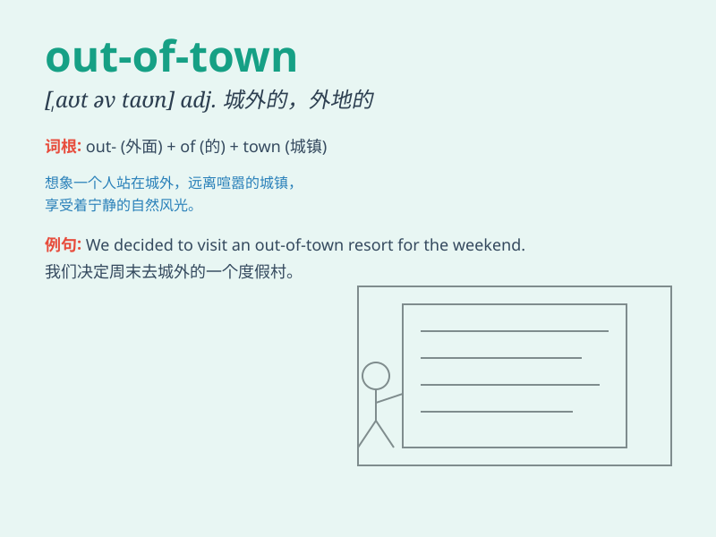

## out-of-town

**英音:** _[ˌaʊt əv ˈtaʊn]_ **美音:** _[ˌaʊt əv ˈtaʊn]_

**译义:** *adj.外地的；城外的*

### 短语

+ **out-of-town business:** _外地业务_

+ **out-of-town guest:** _外地客人_

+ **out-of-town trip:** _外地旅行_

+ **out-of-town office:** _外地办事处_

+ **out-of-town shopping:** _外地购物_

### 例句

#### 例句1

> **We went on an out-of-town trip last weekend.**

**中文翻译:** 上个周末我们进行了一次出城旅行。

**单词释义:** 出城的；外地的

#### 例句2

> **The out-of-town guests were warmly welcomed.**

**中文翻译:** 外地来的客人受到了热烈欢迎。

**单词释义:** 外地的

#### 例句3

> **She has an out-of-town job that requires a lot of traveling.**

**中文翻译:** 她有一份需要经常出差的外地工作。

**单词释义:** 外地的

### 背诵小故事

> One day, Tom decided to take a break from his busy life in the town.
He went on an out-of-town trip. He saw beautiful mountains and peaceful
villages. It was a wonderful escape from the usual.

**有一天，汤姆决定从繁忙的城镇生活中抽身休息一下。他进行了一次出城旅行。他看到了美丽的山峦和平静的村庄。这是一次对日常的美好逃离。**

### 图义

