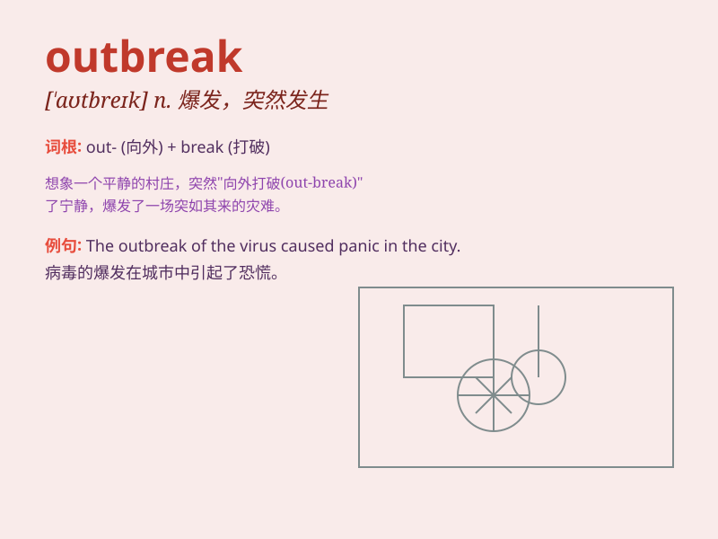

## outbreak

**英音:** _[\'aʊtbreɪk]_ **美音:** _[\'aʊtbrek]_

**译义:** *n.(战争的)爆发,(疾病的)发作*

### 短语

+ **outbreak of disease:** _疾病的爆发_

+ **outbreak of violence:** _暴力的爆发_

+ **outbreak of war:** _战争的爆发_

+ **outbreak of fire:** _火灾的爆发_

+ **outbreak of hostilities:** _敌对行动的爆发_

### 例句

#### 例句1

> **The outbreak of the virus has caused widespread panic.**

**中文翻译:** 病毒的爆发引起了广泛的恐慌。

**单词释义:** 爆发

#### 例句2

> **There was an outbreak of violence in the city last night.**

**中文翻译:** 昨晚该市爆发了暴力事件。

**单词释义:** 爆发

#### 例句3

> **The outbreak of fire destroyed several houses.**

**中文翻译:** 火灾的爆发烧毁了几座房屋。

**单词释义:** 爆发

### 背诵小故事

> In a quiet town, one day, a strange disease suddenly appeared. It
spread quickly among the people. This sudden and widespread occurrence
of the disease was the outbreak. Everyone was scared and started to take
precautions.

**在一个安静的小镇，有一天，一种奇怪的疾病突然出现。它在人们中间迅速传播。这种疾病的突然且广泛的发生就是'outbreak（爆发）'。每个人都很害怕，开始采取预防措施。**

### 图义

