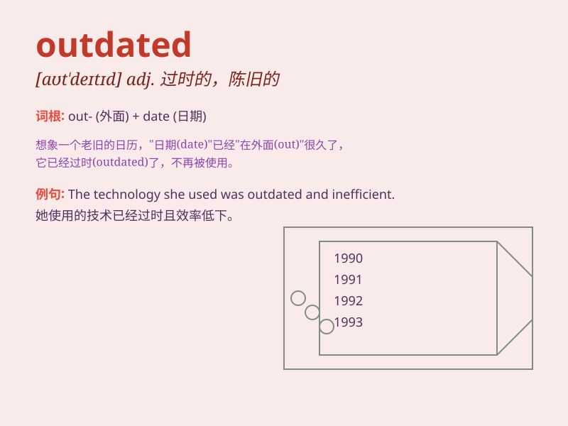

## outdated

**英音:** _[aʊt\'deɪtɪd]_ **美音:** _[\'aʊt\'detɪd]_

**译义:** *adj.过时的,不流行的*

### 短语

+ **outdated information:** _过时的信息_

+ **outdated technology:** _过时的技术_

+ **outdated fashion:** _过时的时尚_

+ **outdated equipment:** _过时的设备_

+ **outdated ideas:** _过时的想法_

### 例句

#### 例句1

> **The software is outdated and needs to be updated.**

**中文翻译:** 该软件已过时，需要更新。

**单词释义:** 过时的

#### 例句2

> **His fashion sense is outdated; he still wears bell-bottoms.**

**中文翻译:** 他的时尚感已经过时了；他仍然穿着喇叭裤。

**单词释义:** 过时的

#### 例句3

> **The company\'s marketing strategy is outdated and
ineffective.**

**中文翻译:** 该公司的营销策略过时且无效。

**单词释义:** 过时的

### 背诵小故事

> A young designer was criticized for his outdated fashion collection.
He had used styles from decades ago and ignored the latest trends. This
made him realize the importance of staying updated.

**一位年轻的设计师因其过时的时装系列而受到批评。他使用了几十年前的风格，忽略了最新的潮流。这使他意识到保持更新的重要性。**

### 图义

