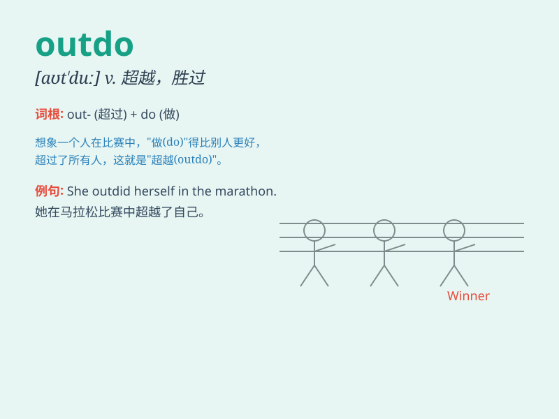

## outdo

**英音:** _[aʊt\'duː]_ **美音:** _[,aʊt\'du]_

**译义:** *v.胜过*

### 短语

+ **outdo oneself:** _超越自我；做得比平时更好_

+ **outdo others:** _超过他人_

+ **outdo in speed:** _在速度上超过_

+ **outdo in strength:** _在力量上超越_

+ **outdo in intelligence:** _在智力上胜出_

### 例句

#### 例句1

> **She always tries to outdo her classmates in every exam.**

**中文翻译:** 每次考试她总是试图超越她的同学。

**单词释义:** 超过；胜过

#### 例句2

> **The new restaurant is trying to outdo its competitors by offering
better service.**

**中文翻译:** 这家新餐厅正试图通过提供更好的服务来超越竞争对手。

**单词释义:** 胜过；优于

#### 例句3

> **In the sports meet, he managed to outdo all the other runners and
won the championship.**

**中文翻译:** 在运动会上，他超越了其他所有的选手，获得了冠军。

**单词释义:** 超越；比......做得好

### 背诵小故事

> Once upon a time, in a sports competition, Tom was determined to
outdo his rival. He trained hard and finally achieved better results.
\'Outdo\' means to do better than someone or something.

**从前，在一场体育比赛中，汤姆决心超过他的对手。他刻苦训练，最终取得了更好的成绩。'outdo'意思是比某人或某物做得更好。**

### 图义

