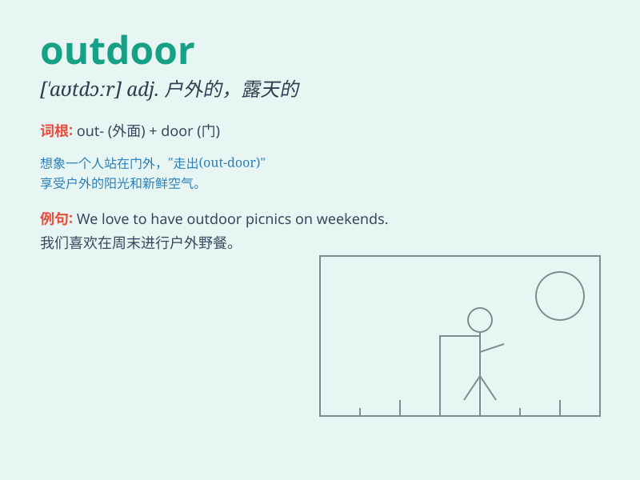

## outdoor

**英音:** _[\'aʊtdɔː]_ **美音:** _[\'aʊt\'dɔr]_

**译义:** *adj.室外的,户外的,野外的*

### 短语

+ **outdoor activities:** _户外活动_

+ **outdoor sports:** _户外运动_

+ **outdoor life:** _户外生活_

+ **outdoor furniture:** _户外家具_

+ **outdoor clothing:** _户外服装_

### 例句

#### 例句1

> **I enjoy outdoor activities like hiking and camping.**

**中文翻译:** 我喜欢徒步旅行和露营等户外活动。

**单词释义:** 户外的；室外的

#### 例句2

> **The outdoor concert was canceled due to bad weather.**

**中文翻译:** 由于天气恶劣，户外音乐会被取消。

**单词释义:** 户外的；室外的

#### 例句3

> **We need to buy some outdoor furniture for the patio.**

**中文翻译:** 我们需要为露台购买一些户外家具。

**单词释义:** 户外的；室外的

### 背诵小故事

> One sunny day, Tom decided to go on an adventure. He packed his bag
and headed outdoors. He enjoyed the fresh air, saw beautiful flowers,
and felt so happy. \'Outdoor\' means outside, away from buildings and
rooms.

**在一个阳光明媚的日子，汤姆决定去冒险。他收拾好背包走向户外。他享受着新鲜的空气，看到了美丽的花朵，感到非常开心。'outdoor'意思是在室外，远离建筑物和房间。**

### 图义

