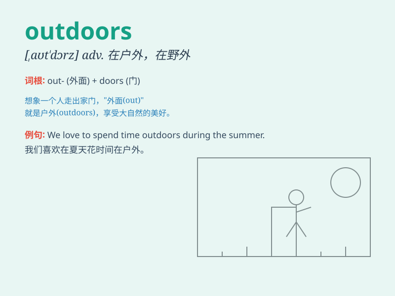

## outdoors

**英音:** _[aʊt\'dɔːz]_ **美音:** _[\'aʊt\'dɔrz]_

**译义:** *n.户外adv.在户外,在野外adj.=outdoor*

### 短语

+ **outdoors activity:** _户外活动_

+ **outdoors sports:** _户外运动_

+ **love the outdoors:** _喜爱户外_

+ **outdoors life:** _户外生活_

+ **outdoors enthusiast:** _户外爱好者_

### 例句

#### 例句1

> **I love spending time outdoors in the summer.**

**中文翻译:** 我喜欢夏天在户外度过时光。

**单词释义:** 在户外；在野外

#### 例句2

> **Children should play outdoors more often.**

**中文翻译:** 孩子们应该多到户外玩耍。

**单词释义:** 在户外；在室外

#### 例句3

> **He works outdoors all year round.**

**中文翻译:** 他常年在户外工作。

**单词释义:** 在户外；在野外

### 背诵小故事

> One sunny day, Tom was feeling bored indoors. So he decided to step
outdoors. There, he saw beautiful flowers and heard birds singing. He
felt so happy and realized that outdoors is where wonderful things
happen.

**在一个阳光明媚的日子，汤姆在室内感到无聊。所以他决定走到户外。在那里，他看到了美丽的花朵，听到了鸟儿歌唱。他感到非常开心，并且意识到户外是美好事情发生的地方。**

### 图义

