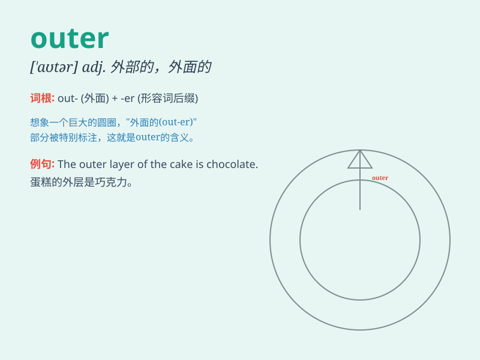

## outer

**英音:** _[\'aʊtə]_ **美音:** _[\'aʊtɚ]_

**译义:** *adj.外部的,外面的,远离中心的n.(射击)环外命中*

### 短语

+ **outer space:** _外太空；外层空间_

+ **outer shell:** _外壳；外层_

+ **outer layer:** _外层；外层部分_

+ **outer garment:** _外衣；外套_

+ **outer limit:** _外部界限；最大限度_

### 例句

#### 例句1

> **The outer layer of the cake was chocolate.**

**中文翻译:** 蛋糕的外层是巧克力。

**单词释义:** 外部的；外面的

#### 例句2

> **She lives in the outer suburbs.**

**中文翻译:** 她住在远郊。

**单词释义:** 远离中心的；外围的

#### 例句3

> **The outer wall of the building needs painting.**

**中文翻译:** 建筑物的外墙需要粉刷。

**单词释义:** 外部的；外侧的

### 背诵小故事

> Imagine you are in a big house. There is a room in the center and
then there are other rooms around it. The rooms around the center one
are called \'outer\' rooms. They are on the outside.

**想象一下你在一个大房子里。有一个房间在中心，然后在它周围还有其他房间。围绕着中心那个房间的房间被称为'outer（外部的）'房间。它们在外面。**

### 图义

