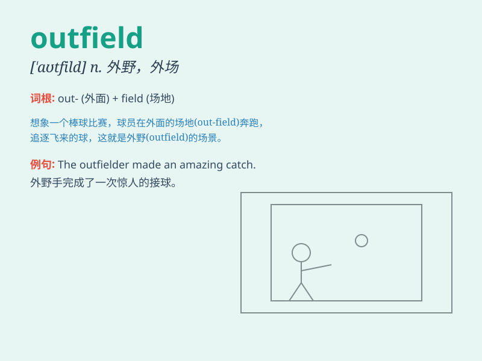

## outfield

**英音:** _[\'aʊtfiːld]_ **美音:** _[\'aʊtfild]_

**译义:** *n.偏远的田园,边境,外场*

### 短语

+ **left outfield:** _左外场_

+ **right outfield:** _右外场_

+ **center outfield:** _中外场_

+ **outfield player:** _外场球员_

+ **outfield position:** _外场位置_

### 例句

#### 例句1

> **The outfield of the baseball stadium was well-maintained.**

**中文翻译:** 棒球场的外场维护得很好。

**单词释义:** （棒球、板球等运动的）外场

#### 例句2

> **He played in the outfield during the game.**

**中文翻译:** 比赛期间他在外场打球。

**单词释义:** 外场

#### 例句3

> **The outfield grass was green and lush.**

**中文翻译:** 外场的草地绿油油的，郁郁葱葱。

**单词释义:** 外场

### 背诵小故事

> A baseball player was lost in the outfield. He had trouble finding
his way back as it was far from the main area. But with the help of his
teammates\' shouts, he finally returned.

**一位棒球运动员在外地迷失了。他很难找到回来的路，因为那里离主要区域很远。但在队友呼喊的帮助下，他最终回来了。**

### 图义

