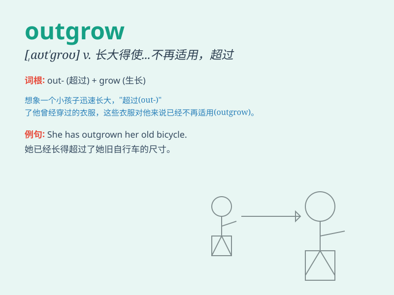

## outgrow

**英音:** _[aʊt\'grəʊ]_ **美音:** _[,aʊt\'ɡro]_

**译义:** *vt.过大而不适于,出生,长出,年久丧失(某种习惯,兴趣等)*

### 短语

+ **outgrow one\'s clothes:** _长得穿不下自己的衣服_

+ **outgrow a childish habit:** _改掉孩子气的习惯_

+ **outgrow a fear:** _不再害怕_

+ **outgrow a playground:** _长大而不再适合在操场玩耍_

+ **outgrow a friendship:** _长大后不再保持某段友谊_

### 例句

#### 例句1

> **The child has outgrown his clothes.**

**中文翻译:** 孩子已经穿不下他的衣服了。

**单词释义:** 长得太大而不再适合

#### 例句2

> **She outgrew her fear of the dark.**

**中文翻译:** 她逐渐克服了对黑暗的恐惧。

**单词释义:** 因长大而不再有

#### 例句3

> **The company has outgrown its small office space.**

**中文翻译:** 该公司的小型办公空间已经无法容纳。

**单词释义:** 发展得超过

### 背诵小故事

> Once upon a time, a little tree was in a small pot. As time passed,
it outgrew the pot. It became too big and strong for its small home.
Just like we outgrow old clothes or toys when we grow up.

**从前，有一棵小树在一个小花盆里。随着时间的推移，它长大了，花盆装不下它了。就像我们长大后穿不下旧衣服或不再玩旧玩具一样。**

### 图义

