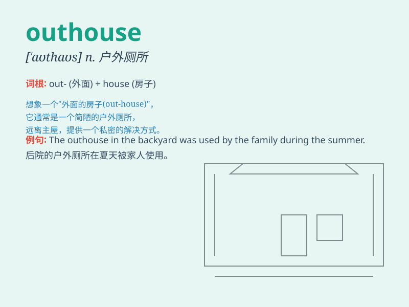

## outhouse

**英音:** _[\'aʊthaʊs]_ **美音:** _[\'aʊthaʊs]_

**译义:** *n.外屋,厕所*

### 短语

+ **outhouse toilet:** _户外厕所_

+ **back outhouse:** _后屋_

+ **old outhouse:** _旧的外屋_

+ **small outhouse:** _小的外屋_

+ **wooden outhouse:** _木制的外屋_

### 例句

#### 例句1

> **The outhouse was located at the far end of the garden.**

**中文翻译:** 外屋位于花园的尽头。

**单词释义:** 户外厕所

#### 例句2

> **They had to use the outhouse when the indoor plumbing broke.**

**中文翻译:** 当室内管道破裂时，他们不得不使用室外厕所。

**单词释义:** 户外厕所

#### 例句3

> **The old farmhouse still had a dilapidated outhouse.**

**中文翻译:** 老农舍里还有一间破旧的外屋。

**单词释义:** 户外厕所

### 背诵小故事

> Once upon a time, a little boy was lost in the forest and found an
outhouse. It was a small shed outside the main house. He was scared but
finally found his way back home thanks to it.

**从前，有个小男孩在森林里迷路了，然后发现了一个外屋。这是主屋外面的一个小棚屋。他很害怕，但最终因为它找到了回家的路。**

### 图义

