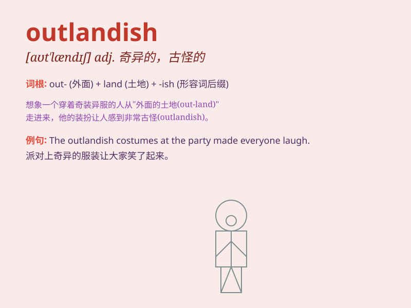

## outlandish

**英音:** _[aʊt\'lændɪʃ]_ **美音:** _[aʊt\'lændɪʃ]_

**译义:** *adj.外国气派的,偏僻的,古怪的,奇异的*

### 短语

+ **outlandish idea:** _古怪的想法_

+ **outlandish costume:** _奇异的服装_

+ **outlandish behavior:** _怪异的行为_

+ **outlandish story:** _荒诞的故事_

+ **outlandish claim:** _离奇的主张_

### 例句

#### 例句1

> **She wore an outlandish outfit to the party that caught
everyone\'s attention.**

**中文翻译:** 她在聚会上穿着一身奇装异服，引起了所有人的注意。

**单词释义:** 古怪的；奇异的（形容服装）

#### 例句2

> **His outlandish ideas were met with skepticism by the
committee.**

**中文翻译:** 他的古怪想法遭到了委员会的怀疑。

**单词释义:** 稀奇古怪的（形容想法）

#### 例句3

> **The design of the building was so outlandish that it became a
local landmark.**

**中文翻译:** 该建筑的设计如此奇特，以至于成为当地的地标。

**单词释义:** 奇特的（形容建筑设计）

### 背诵小故事

> A man wore an outlandish costume to the party. It was a suit with
bright colors and strange patterns. Everyone was shocked and stared at
him. He stood out like a strange bird.

**一个男人穿着奇装异服去参加派对。那是一套有着鲜艳颜色和奇怪图案的套装。每个人都很震惊，盯着他看。他就像一只奇怪的鸟一样引人注目。**

### 图义

