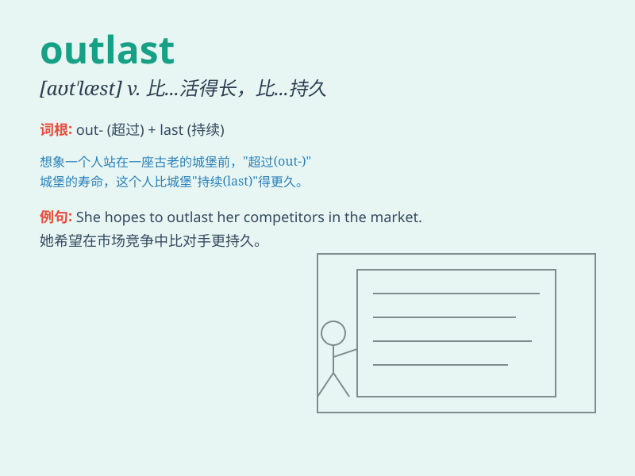

## outlast

**英音:** _[aʊt\'lɑːst]_ **美音:** _[,aʊt\'læst]_

**译义:** *vt.比\...长久,比\...活得长*

### 短语

+ **outlast the storm:** _比暴风雨持续更久_

+ **outlast one\'s rivals:** _比对手持续得更久_

+ **outlast the enemy:** _比敌人存在得更久_

+ **outlast the difficulty:** _比困难持续得更久_

+ **outlast the challenge:** _比挑战持续得更久_

### 例句

#### 例句1

> **The old building has outlasted many modern ones.**

**中文翻译:** 这座古老的建筑比许多现代建筑更古老。

**单词释义:** 比\...长久；比\...持久

#### 例句2

> **He managed to outlast his rivals in the race.**

**中文翻译:** 他在比赛中比对手坚持得更久。

**单词释义:** 比\...持续得久

#### 例句3

> **This type of battery is designed to outlast the previous
model.**

**中文翻译:** 这种类型的电池比以前的型号更耐用。

**单词释义:** 比\...经久；比\...耐用

### 背诵小故事

>
想象一下，在一场漫长的马拉松比赛中，小明一直坚持奔跑，其他人都累得跑不动了，最终小明成功地
outlast 了所有对手。意思就是他比其他人更持久、更耐得住。

**想象小明在马拉松比赛中比其他对手更持久、更耐得住**

### 图义

