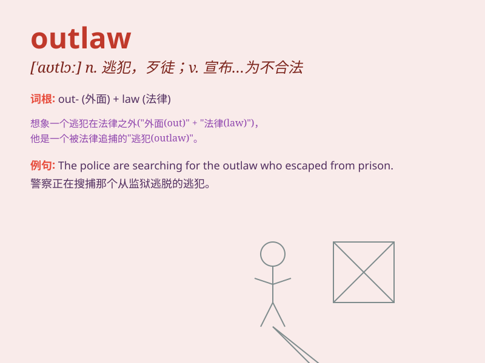

## outlaw

**英音:** _[\'aʊtlɔː]_ **美音:** _[\'aʊtlɔ]_

**译义:** *n.歹徒,逃犯,丧失公权者v.将\...放逐,宣布\...为不合法*

### 短语

+ **outlaw gang:** _不法帮派_

+ **become an outlaw:** _成为逃犯_

+ **outlaw state:** _非法国家_

+ **outlaw activity:** _非法活动_

+ **outlaw motorcycle gang:** _非法摩托车帮派_

### 例句

#### 例句1

> **The government has outlawed the use of certain pesticides.**

**中文翻译:** 政府已禁止使用某些农药。

**单词释义:** 宣布...为不合法；禁止

#### 例句2

> **He was an outlaw who lived in the forest.**

**中文翻译:** 他是一个住在森林里的亡命之徒。

**单词释义:** 逃犯；不法之徒

#### 例句3

> **The new law will outlaw discrimination based on gender.**

**中文翻译:** 新法律将禁止基于性别的歧视。

**单词释义:** 宣布...为不合法；禁止

### 背诵小故事

> In a wild west town, a bandit named Jack was declared an \'outlaw\'
for robbing banks and causing chaos. The sheriff and his deputies were
determined to catch him and bring justice. Poor Jack, now an outcast,
had nowhere to hide.

**在一个西部荒野小镇，一个叫杰克的强盗因抢劫银行和制造混乱被宣布为'不法之徒'。警长和他的副手们决心抓住他并伸张正义。可怜的杰克，现在成了被驱逐者，无处可藏。**

### 图义

