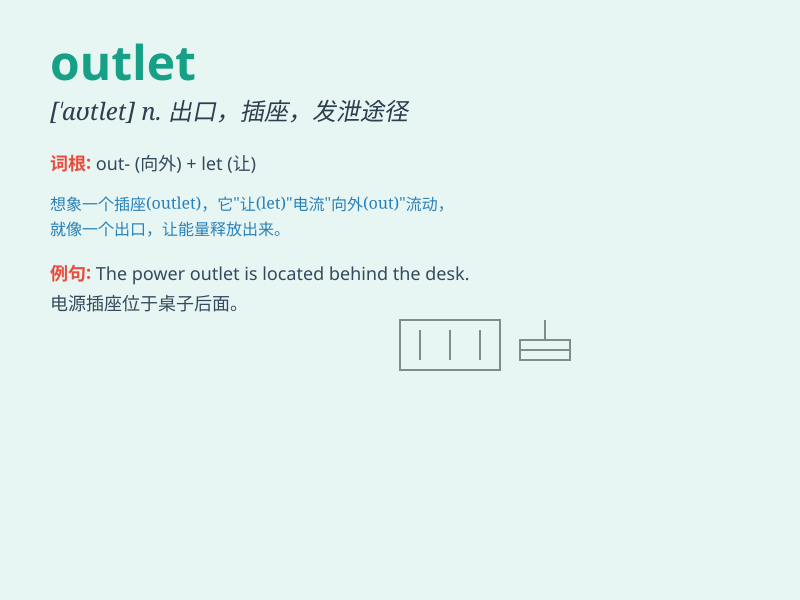

## outlet

**英音:** _[\'aʊtlet]_ **美音:** _[\'aʊtlɛt]_

**译义:** *n.出口,出路*

### 短语

+ **power outlet:** _电源插座_

+ **outlet store:** _工厂直销店；折扣店_

+ **outlet pipe:** _出口管；排水管_

+ **outlet valve:** _出口阀_

+ **emotional outlet:** _情感宣泄的途径_

### 例句

#### 例句1

> **This store is an outlet for discounted designer clothing.**

**中文翻译:** 这家商店是折扣名牌服装的专卖店。

**单词释义:** 销售点；专卖店

#### 例句2

> **She needed an outlet for her creativity.**

**中文翻译:** 她需要一个发挥创造力的出口。

**单词释义:** 途径；渠道

#### 例句3

> **The power outlet seems to be broken.**

**中文翻译:** 电源插座似乎坏了。

**单词释义:** 插座；出口

### 背诵小故事

> 想象一个探险家在森林中迷路很久，又饿又累。突然，他发现了一个
OUTLET（出口），兴奋地跑过去，那是他脱离困境、重获自由的希望之门。

**想象一位探险家在森林中迷路许久，又饿又累。突然，他发现了一个'出口'，兴奋地跑过去，这是他脱离困境、重获自由的希望之门。**

### 图义

