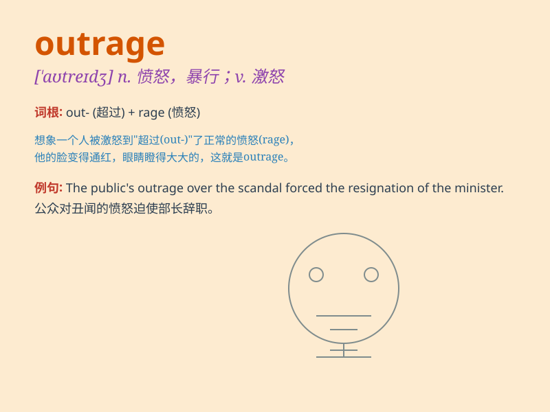

## outrage

**英音:** _[\'aʊtreɪdʒ]_ **美音:** _[\'aʊtredʒ]_

**译义:** *n.暴行,侮辱,愤怒vt.凌辱,引起\...义愤,强奸*

### 短语

+ **commit an outrage:** _做出暴行_

+ **cause outrage:** _引起愤怒_

+ **public outrage:** _公众的愤怒_

+ **feel outrage:** _感到愤怒_

+ **outrage at something:** _对某事感到愤怒_

### 例句

#### 例句1

> **The public outrage at the politician\'s corruption was
palpable.**

**中文翻译:** 公众对政客腐败的愤怒是显而易见的。

**单词释义:** 愤怒；义愤

#### 例句2

> **The new law has caused outrage among the citizens.**

**中文翻译:** 新法律引起了公民的愤怒。

**单词释义:** 愤怒；愤慨

#### 例句3

> **His actions outraged the entire community.**

**中文翻译:** 他的行为激怒了整个社区。

**单词释义:** 激怒；使震怒

### 背诵小故事

> A group of bad guys entered a peaceful village and did many bad
things, which caused outrage among the villagers. They were very angry
and decided to fight back to protect their home.

**一群坏人进入了一个平静的村庄，做了很多坏事，这引起了村民们的愤怒。他们非常生气，决定反击来保护自己的家园。**

### 图义

