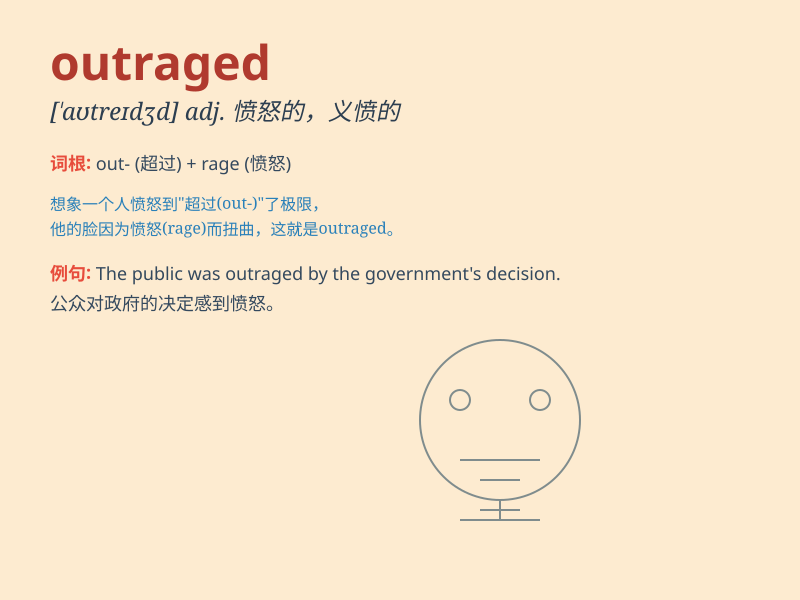

## outraged

**英音:** _[ˈaʊtreɪdʒd]_ **美音:** _[ˈaʊtreɪdʒd]_

**译义:** *adj. 愤怒的；愤慨的；义愤填膺的；v.
使震怒；激怒（outrage 的过去分词）*

### 短语

+ **be outraged at:** _对\...\...感到愤怒_

+ **outraged protest:** _愤怒的抗议_

+ **feel outraged:** _感到愤怒_

+ **outraged citizens:** _愤怒的市民_

+ **outraged reaction:** _愤怒的反应_

### 例句

#### 例句1

> **The public was outraged by the politician\'s corrupt
behavior.**

**中文翻译:** 公众对这位政客的腐败行为感到愤怒。

**单词释义:** 愤怒的；愤慨的

#### 例句2

> **She was outraged when she found out she had been cheated.**

**中文翻译:** 当她发现自己被骗时，她非常愤怒。

**单词释义:** 极其生气的；怒不可遏的

#### 例句3

> **The community was outraged at the proposal to build a factory in
the park.**

**中文翻译:** 社区对在公园内建工厂的提议感到愤怒。

**单词释义:** 被激怒的；义愤填膺的

### 背诵小故事

> A peaceful village was suddenly attacked by bandits. The villagers\'
properties were stolen and some were even hurt. They felt outraged and
decided to unite to fight back and protect their home.

**一个宁静的村庄突然遭到土匪的袭击。村民们的财物被偷，甚至有人受伤。他们感到愤怒不已，决定团结起来反击并保护自己的家园。**

### 图义

