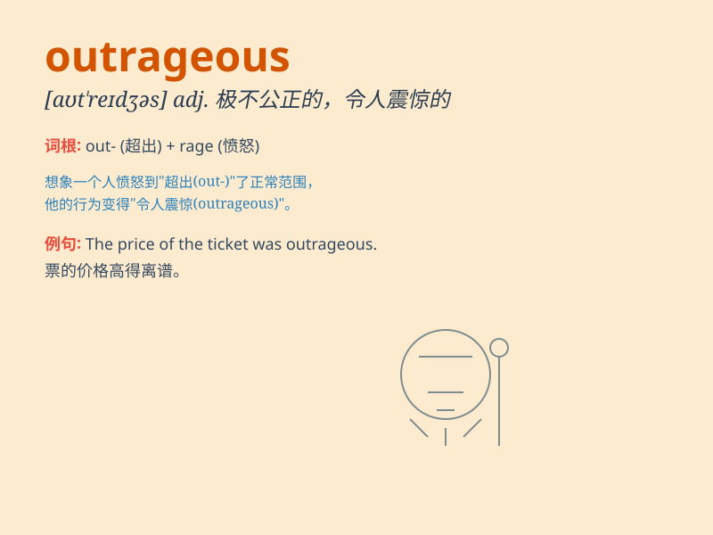

## outrageous

**英音:** _[aʊt\'reɪdʒəs]_ **美音:** _[aʊt\'redʒəs]_

**译义:** *adj.蛮横的,残暴的,无耻的,可恶的,令人不可容忍的*

### 短语

+ **outrageous behavior:** _粗暴的行为_

+ **outrageous price:** _过高的价格_

+ **outrageous claim:** _离谱的要求_

+ **outrageous lie:** _无耻的谎言_

+ **outrageous costume:** _奇异的服装_

### 例句

#### 例句1

> **The price of that dress is outrageous.**

**中文翻译:** 这件衣服的价格贵得离谱。

**单词释义:** 过分的；离谱的

#### 例句2

> **His outrageous behavior at the party shocked everyone.**

**中文翻译:** 他在聚会上的无耻行为震惊了所有人。

**单词释义:** 放肆的；骇人的

#### 例句3

> **The idea of such an outrageous tax increase is unacceptable.**

**中文翻译:** 如此无耻的增税想法是不可接受的。

**单词释义:** 极端的；令人不能容忍的

### 背诵小故事

> A thief broke into a store and stole expensive jewelry in an
outrageous way. The police were shocked by his bold and lawless act.
This incident made everyone feel angry and indignant.

**一个小偷以一种极其放肆的方式闯进一家商店并偷走了昂贵的珠宝。警察对他这种大胆且无法无天的行为感到震惊。这一事件让每个人都感到愤怒和愤慨。**

### 图义

