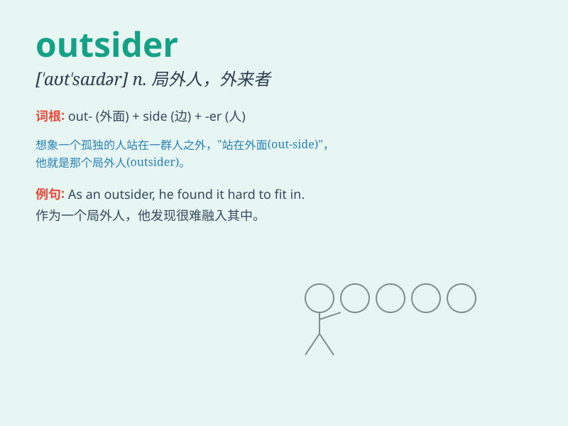

## outsider

**英音:** _[aʊt\'saɪdə]_ **美音:** _[\'aʊt\'saɪdɚ]_

**译义:** *n.无取胜希望者*

### 短语

+ **an outsider to something:** _对某事不熟悉的人_

+ **be regarded as an outsider:** _被视为局外人_

+ **outsider perspective:** _局外人的视角_

+ **remain an outsider:** _一直是局外人_

+ **feel like an outsider:** _感觉像个局外人_

### 例句

#### 例句1

> **He always felt like an outsider at social gatherings.**

**中文翻译:** 在社交聚会上，他总是感觉自己像个局外人。

**单词释义:** 局外人；外人

#### 例句2

> **The new employee was seen as an outsider by the old team.**

**中文翻译:** 新员工被老团队视为局外人。

**单词释义:** 外人；外来者

#### 例句3

> **She\'s an outsider in the fashion industry, but she\'s determined
to make it.**

**中文翻译:** 她是时尚界的局外人，但她决心要成功。

**单词释义:** 外行；门外汉

### 背诵小故事

> A man always felt lonely because he was an outsider in the village.
No one invited him to parties or shared secrets with him. But one day,
he used his kindness to help everyone and finally became part of the
community.

**一个男人总是感到孤独，因为他在村子里是个局外人。没人邀请他参加聚会，也没人和他分享秘密。但有一天，他用自己的善良帮助了每个人，最终成为了社区的一份子。**

### 图义

