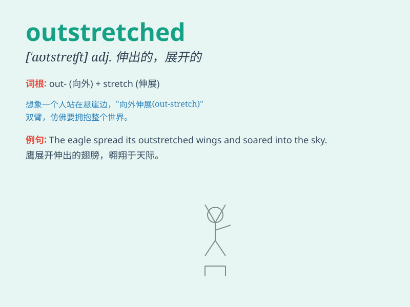

## outstretched

**英音:** _[ˌaʊtˈstretʃt]_ **美音:** _[ˌaʊtˈstretʃt]_

**译义:** *adj.伸出的,伸展的*

### 短语

+ **outstretched arms:** _伸展的手臂_

+ **outstretched hand:** _伸出的手_

+ **outstretched legs:** _伸直的腿_

+ **outstretched wings:** _展开的翅膀_

+ **keep outstretched:** _保持伸展_

### 例句

#### 例句1

> **He lay on the grass with his arms outstretched.**

**中文翻译:** 他躺在草地上，张开双臂。

**单词释义:** 伸展的；张开的

#### 例句2

> **The bird flew away with its outstretched wings.**

**中文翻译:** 小鸟展开翅膀飞走了。

**单词释义:** 伸展的；张开的

#### 例句3

> **She reached out with an outstretched hand.**

**中文翻译:** 她伸出一只手。

**单词释义:** 伸展的；张开的

### 背诵小故事

> A brave adventurer was lost in a forest. When he saw a rescue
helicopter, he ran and waved with his outstretched arms, hoping to be
noticed. Finally, he was saved. The outstretched arms were his last
hope.

**一位勇敢的探险家在森林里迷路了。当他看到救援直升机时，他跑着并张开双臂挥舞，希望被注意到。最终，他得救了。张开的双臂就是他最后的希望。**

### 图义

